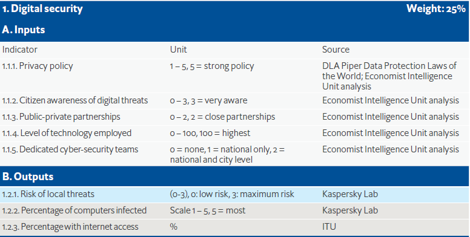
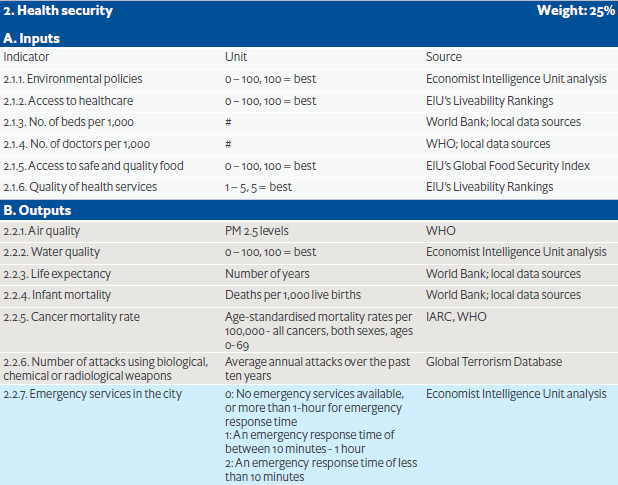
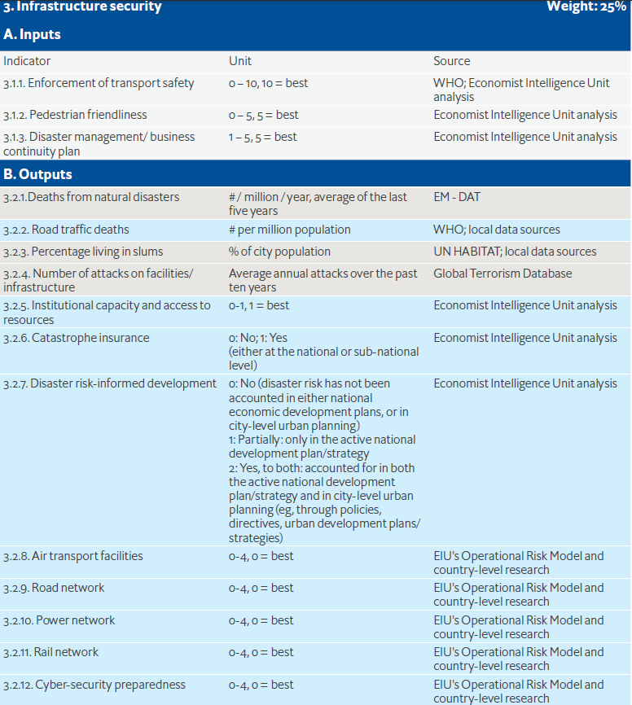
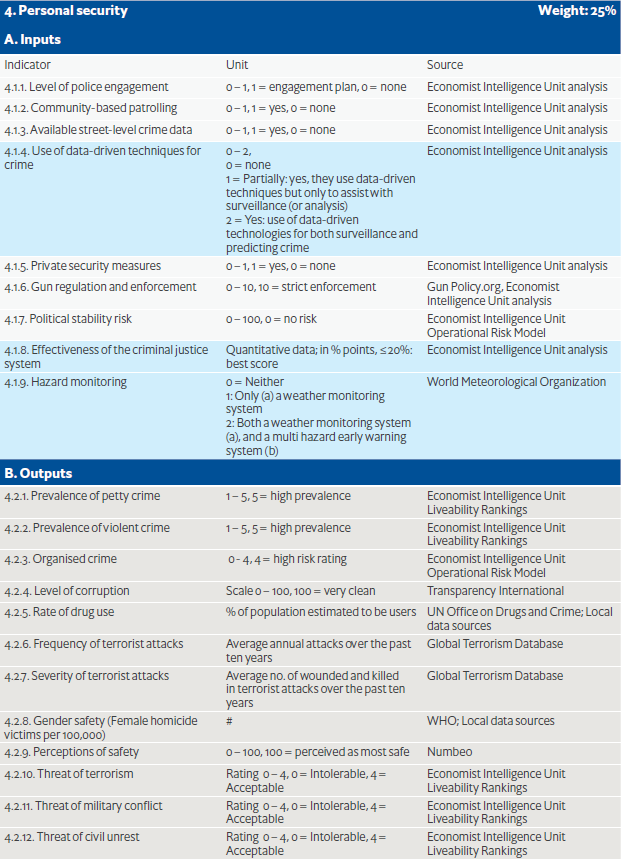

【英国经济学人智库自2015年开始发布“全球安全城市指数”，至今已发布2015年、2017年、2019年３个版本，入选城市从2015年的50个增至2017年的60个，2019年又对60个城市进行个别调整。指标数量从2015年的44个增至2017年的49个，2019年继续增至57个。每一版“全球安全城市指数”都有不同的关注点。2015年的“全球安全城市指数”力求全面、客观、准确地评估数字时代的城市安全，数字安全的引入是其最主要的特征。2017年新增的指标主要针对恐怖袭击带来的安全问题，以及政治冲突或社会动荡带来的不安定因素，关注点延伸至城镇化进程中不断扩张的城市人口引发的问题。2019年的“全球安全城市指数”聚焦于评估城市应对风险灾害的预防准备能力，形成了全面完善的城市韧性评估框架。评价指标分为数字安全、卫生安全、基础设施安全和人身安全４个维度，每个维度的指标又分为“投入”和“结果”两大类。“投入”类指标侧重于考察城市在政策、人员、资金等方面对提升城市韧性所做的努力，“结果”类指标反映的是城市安全的客观现状。两者结合，不仅能够反映各城市天然的易受风险程度，还能够反映韧性基础设施和风险预防准备等情况。(卢溪.基于“全球安全城市指数”的上海韧性城市建设思考.)】

【安全城市指数有两个方面的指标，一个是输入指标，一个是输出指标。输入指标包括政策方面，输出指标主要是衡量效果的指标，包括一些KPI，比如交通事故的伤亡率、犯罪率以及灾难造成的人员伤亡率等。在绝大多数情况下，衡量一个城市的安全性都主要是参考输出指标，但是通过加大对输出指标的考察可以尽可能确保政策制定者能为将来制定恰当的政策。

报告中所涉及的排名是主要根据数字安全、卫生安全、基础设施安全和个人
安全四个方面进行评分，具备一定的典型性和参考价值。**第一，数字安全**。主要包括城市的隐私政策、公民对数字威胁的意识、是否拥有专门的网络安全团队以及本地恶意软件威胁的风险等指标。一些发达国家中排名比较靠前的城市都有一个强大的网络安全法，有相对完善和形成体系的隐私保护政策，市民对网络的威胁意识普遍存在比较强的认知度，还有专门的团队保护网络安全。比如，新加坡政府就已经成立了网络监视部门。**第二，卫生安全**。重点关注环境政策、医疗保健、安全食品、空气和水质以及预期寿命。城市安全的建设需要有力的环境政策，易于获得的医疗服务，可靠的紧急救援服务。在环保方面，日本从空气污染到废物处理都制定了严格的规定，有环保的监测政策，也有对于水质进行的监测。医疗要有比较好的覆盖，日本在东京有非常高标准的医疗服务。可靠的紧急救援服务是关键，这些排名靠前的城市出现了紧急情况，响应时间不到10分钟。**第三，基础设施安全**。主要着眼于交通状况和交通安全、行人友好与否、灾害管理以及道路和电力网络的可靠性等指标。排名前面的城市有共同的特点，它有强大的道路安全法，另外有超速和违章的摄像头，还有方便行人的街道，这是和城市规划相关的。城市规划也做得非常好，大家走路的时候非常安全。很好的业务连续性可以不断地更新他们的城市安全建设计划。政府在制定综合战略的同时，只有充分考虑各组织机构、企业等具体情况，认识上达成高度的统一，行动上才能保持一致。**第四，个人安全**。重点考察警务力量分配、犯罪数据获取、管制和执法以及刑事司法系统的有效性。这也是城市安全建设中需要重点关注的方面，警察要有非常好的系统能支持大家的生活，能有数据驱动的技术防止犯罪和预防犯罪。数十年来，新加坡类似抢劫、偷盗等传统犯罪的犯罪率极端低下，这让警方有了更多精力应对网络犯罪，该国旨在建设数字安全的“智慧城市”。（斯特凡诺·斯库拉蒂.关于安全城市指数的研究.中国应急管理,2020,12.）】

# 关于报告

2019年《安全城市指数》是经济学人智库发布的报告，由NEC公司主办。该报告基于该指数第三迭代（the third iteration of the index），该指数对60个城市的57项指标进行排名，涵盖数字安全（digital security），卫生安全（health security），基础设施安全（infrastructure security）和人身安全（personal）。

# 执行摘要（Executive summary）

Humanity is a predominantly urban species, with over 56% of us living in cities. By 2050 68% will do so, reflecting a speed of urbanisation even faster than previously predicted. This process is occurring most visibly in developing countries, some of which struggle to deal with the extent of change. Indeed, the challenges of urbanisation, if unmet, can entail substantial human and economic risks. On the other hand, if they are effectively addressed, the growth of cities may become an essential part of how emerging economies find a way to catch up to those in more developed countries and how humanity as a whole creates more sustainable ways to live.

人类是一个主要生活在城市的物种，超过56%的人生活在城市。到2050年，将有68%的人生活在城市，这反映出城市化的速度甚至比以前预测的还要快。这一进程在发展中国家发生得最为明显，其中一些国家正在努力应对这一变化的程度。事实上，城市化的挑战如果不加以应对，可能会带来巨大的人力和经济风险。另一方面，如果有效地应对这些挑战，城市的发展可能会成为新兴经济体如何找到追赶较发达国家的途径以及整个人类如何创造更可持续的生活方式的重要组成部分。

Thus, urban management will play a fundamental role in defining the quality of life of most human beings in the coming years. A key element of this will be the ability of cities to provide security for their residents, businesses and visitors. Accordingly, The Economist Intelligence Unit, sponsored by NEC Corporation, maintains the Safe Cites Index (SCI)—a detailed benchmarking tool that measures a wide range of security inputs and results.

因此，城市管理将在决定未来几年大多数人的生活质量方面发挥重要作用。这其中的一个关键因素将是城市为居民、企业和游客提供安全保障的能力。因此，由NEC公司赞助的经济学人智库（The Economist Intelligence Unit）推出了安全城市指数（SCI）--一个详细的基准工具，用于衡量广泛的安全投入和结果。

The SCI has always reflected the multifaceted nature of urban safety, with indicators divided into four distinct pillars: digital, infrastructure, health and personal security. The 2019 version (SCI2019)—which this report accompanies the release of—benefits from a major revision designed to better measure “urban resilience”. This concept—the ability of cities to absorb and bounce back from shocks—has had an increasing influence on thinking in urban safety over the last decade, especially as policymakers worry about the implications of climate change. Rather than trying to create a fifth distinct pillar of security, the index now measures new areas within the other four of particular relevance to resilience such as disaster-risk informed development policies.

SCI一直反映了城市安全的多面性，其指标分为四个不同的核心：数字、基础设施、健康和个人安全。2019年版本（SCI2019）--本报告随同发布--得益于一次重大修订，旨在更好地衡量 "城市复原力"。这个概念--城市吸收冲击并从冲击中反弹的能力--在过去十年中对城市安全方面的思考产生了越来越大的影响，特别是在政策制定者担心气候变化的影响时。该指数并没有试图建立第五个不同的安全核心，而是在其他四个与复原力特别相关的领域中衡量新的领域，如灾害风险知情发展政策。

The key findings from the expanded and updated SCI this year include:

今年扩大和更新的SCI的主要结论包括

+ **Tokyo again comes first overall, and Asia-Pacific cities make up six of the top ten, but geographic region does not have a statistical link with results.** As it did in the previous
SCI, Tokyo has the highest overall score in our index. Other cities in the top ten are Singapore
(2nd), Osaka (3rd), Sydney (5th), Seoul (tied 8th) and Melbourne (10th). Two European cities are
in this group, Amsterdam (4th) and Copenhagen (tied 8th), while two from America complete
it, Toronto (6th) and Washington, DC (7th). However, a closer look at the important correlates
of security, discussed below, found city safety is not related to global region: Tokyo, Singapore
and Osaka lead because of their specific strengths, not because they happen to be in Asia.

东京再次位居第一，前十名中亚太城市占了六个，但地理区域与结果没有统计联系。
在我们的指数中，SCI、东京的综合得分最高。其他进入前十名的城市有新加坡
第2名）、大阪（第3名）、悉尼（第5名）、首尔（并列第8名）和墨尔本（第10名）。两个欧洲城市是
阿姆斯特丹(第4名)和哥本哈根(并列第8名)在本组中排名第一，而美国的两名选手则在本组中排名第二。
它、多伦多（第6）和华盛顿特区（第7）。然而，仔细研究一下重要的相关因素
以下讨论的安全问题，发现城市安全与全球区域无关。东京、新加坡
和大阪领先是因为他们的具体实力，而不是因为他们恰好在亚洲。

+ **The results in individual index pillars show the importance of getting the basics right.**
Leo Tolstoy famously wrote, “All happy families are alike: each unhappy family is unhappy in its
own way.” A look at the top five cities in each pillar—digital, health, infrastructure and personal security—yields a similar message. In each area, leading cities got the basics right, be it easy access to high-quality healthcare, dedicated cyber-security teams, community-based police
patrolling or disaster continuity planning. Even among the leaders, the weaknesses of those
not in first place tended to vary from city to city. Those who want to improve need to get the
basics in place and then consider their own specific situations.

各个指数核心的结果显示了做好基本工作的重要性。列奥-托尔斯泰有句名言："所有幸福的家庭都一样，不幸的家庭各有各的不幸。"看一看每个核心--数字、健康、基础设施和个人安全--中排名前五的城市，就会得到类似的信息。在每个领域，领先的城市都做好了基本功，无论是便捷的高质量医疗服务、专门的网络安全团队、基于社区的警察巡逻或灾害连续性规划。即使在领导人中，首屈一指的人的弱点也因城市而异。想要提高的人，需要把基础工作做到位，再考虑自己的具体情况。

Looking at the index results as a whole provides a number of key insights into urban security:

从整个指数结果来看，对城市安全有许多重要启示。

+ **Despite having many elements, city safety is indivisible.** The different kinds of security
covered by the index require distinct interventions, often by different agencies or actors,
such as health systems for medical care and police for public order. Amid this diversity,
though, statistical analysis of the SCI2019 results shows that performance in each of the
pillars correlates very closely with that in every other. In short, cities tend to do well, middling or poorly across every security pillar rather than having good results in one and lagging in others. This is consistent with expert commentary that, rather than representing clearly
distinct fields, different kinds of safety are thoroughly intertwined and mutually supportive.

 城市安全虽然有很多要素，但不可分割。指标涵盖的不同类型的安全性需要不同的干预措施，通常是由不同的机构或参与者进行干预，例如医疗卫生系统和公共秩序警察。但是，在这种多样性中，对SCI2019结果的统计分析表明，每个支柱的绩效都与彼此的绩效紧密相关。简而言之，在每个安全核心上，城市往往表现良好，中等或较差，而不是在一个方面取得好成绩而在其他方面却落后。这与专家评论一致，即不同种类的安全性不会完全代表不同的领域，而是相互交织并相互支持的。

> Service planning and provision must take this into account. Technological investments
for infrastructure, for example, can bring health benefits, while enhanced cyber-security
will protect the ability of the city to provide every kind of security, not just protection of
digital systems.

服务规划和提供必须考虑到这一点。例如，对基础设施的技术投资可以带来健康效益，而加强网络安全将保护城市提供各种安全的能力，而不仅仅是保护数字系统。

+ **The SCI2019 results are not evenly spread but have a large number of cities clustered at the top, with the rest showing much more variation in scores.** Just 10 points separate
the overall scores of the top 24 cities, while the following 36 are over 40 points apart. This
does not mean that the differences in the leaders’ group are unimportant. Instead, on a scale
that can measure every index city, the large group of top cities are much more similar to each
other than to those lagging behind.

SCI2019的成绩并不均匀，而是有大量的城市集中在前列，其余城市的分数差异较大。前24个城市的总分仅相差10分，而下面的36个城市相差40多分。这并不意味着领导者群体的差异不重要。相反，在能够衡量每一个指数城市的尺度上，大集团的顶尖城市之间的相似度要远远高于落后的城市。

+ **Higher income sets apart those with better results, but in ways that are less than obvious.** The index scores correlate strongly with average income in the cities. In part
this reflects the need to invest sometimes substantial amounts in certain areas essential
to security, such as high-quality infrastructure or advanced healthcare systems. The more
surprising contribution to this correlation is that, across our index, those cities with less wealth also tend to lack policy ambition. As one interviewee told us, the biggest challenges facing Sub-Saharan African cities reflect a lack of effective planning and management. Low-hanging
(or at least relatively low-cost) fruit exist, which all cities that have not already done so should attempt to harvest. Doing so requires focus and perseverance.

较高的收入使那些成绩较好的人脱颖而出，但在某些方面却不太明显。指数得分与城市的平均收入密切相关。部分原因是 这反映了有时需要在某些重要领域进行大量投资。到安全，如高质量的基础设施或先进的医疗系统。愈 导致这种关联性的一个令人惊讶的因素是，在我们的指数中，那些财富较少的城市也往往缺乏政策雄心。正如一位受访者所言，撒哈拉以南非洲城市面临的最大挑战是缺乏有效规划和管理。悬而未决的问题 (或至少是成本相对较低的)果实存在，所有还没有这样做的城市都应该尝试收获这些果实。这样做需要专注和坚持不懈的努力。

+ **Transparency matters as much as wealth to urban security.** Levels of transparency in
cities, as measured by the World Bank’s Control of Corruption metric, correlated as closely
as income with index scores. Correlation does not guarantee causation, but interviewed
experts stressed the many ways that transparency and accountability are essential in every
pillar of urban security, from building safer bridges to developing the trust needed for relevant
stakeholders to share information on cyber-attacks. Well-governed, accountable cities are
safer cities.

透明度与财富对城市安全的重要性不相上下。按世界银行的腐败控制指标衡量的城市透明度水平与收入一样与指数得分密切相关。相关性并不能保证因果关系，但受访者表示，城市的透明度与收入密切相关。
专家们强调，透明度和可问责性在每个国家都是至关重要的。从建设更安全的桥梁到发展相关的信任，是城市安全的核心。利益攸关方分享网络攻击的信息。治理良好、负责任的城市是 更安全的城市。

+ **Transparency and a new understanding of the elements of urban safety are essential to resilience.** Those parts of our index most directly related to resilience indicate that,
as with safety more generally, higher incomes are associated with better preparedness.
This is unsurprising: technologically advanced infrastructure, for example, if appropriately
deployed, can be an important contributor to resilience. In this case, though, transparency
and accountability seem to be of even greater importance: a poorly governed city will almost
never be resilient.

透明度和对城市安全要素的新认识对复原力至关重要。我们的指数中与复原力最直接相关的部分表明，与更普遍的安全问题一样，收入越高，准备越充分。这一点并不奇怪：例如，技术先进的基础设施，如果部署得当，可以成为复原力的重要促进因素。不过，在这种情况下，透明度和问责制似乎更为重要：一个治理不善的城市几乎永远不会有复原力。

> Although not able to offer a general prescription for resilience, our research points to
a number of key elements, including joint planning by all relevant stakeholders, both
governmental and non-governmental, to prepare for shocks; a new understanding of
infrastructure that uses a city’s natural assets as tools to enhance its ability to absorb
shocks; and the importance of promoting social connectedness among citizens in creating
communities that will work together in a crisis.

虽然我们无法提供复原力的一般处方，但我们的研究指出了一些关键要素，包括所有相关利益攸关方（包括政府和非政府利益攸关方）为应对冲击而进行的联合规划；对利用城市自然资产作为工具的基础设施有了新的认识，以增强其吸收冲击的能力；以及促进公民之间的社会联系，以创建将在危机中共同努力的社区的重要性。

# Introduction: Why urban safety matters to us all

导语：为什么城市安全对我们所有人都很重要？

## A disorderly transition toward ever-greater urbanity

向着越来越大的城市化无序过渡

Humanity is a predominantly urban species, having become so a little
over a decade ago according to UN Population Division data. And it is
becoming even more so: the 56% of the world’s population who live in
cities today will rise to 68% by 2050.

根据联合国人口司的数据，人类是一个以城市为主的物种，十多年前就已经成为城市物种。而且这种情况正在变得更加严重：目前世界上56%的人口居住在城市，到2050年将上升到68%。

More than simply where most humans live, cities are where we do
business, producing an outsized proportion of economic output
because of a greater efficiency than rural areas. New Climate Initiative,
a think-tank, estimated that in 2015 urban areas in total created 85% of
the world’s GDP while generating only 71% to 76% of greenhouse gas
emissions. Accordingly, the success or failure of cities will define the
quality of human life in the years ahead.

城市不仅仅是大多数人生活的地方，也是我们生活的地方。据智库 "新气候倡议 "估计，2015年城市地区共创造了85%的世界GDP，而产生的温室气体排放量却只有71%到76%。据智库 "新气候倡议 "估计，2015年城市地区共创造了全球85%的GDP，而产生的温室气体排放量却只有71%至76%，因此，城市的成败将决定未来几年人类生活的质量。

This may seem like old news: urbanisation has been occurring for many
decades, and for centuries in some regions. Familiarity with the longterm
narrative, however, should not obscure the current challenge’s
novelty. First, as Adie Tomer, who leads the Metropolitan Infrastructure
Initiative at the Brookings Institution, a think-tank, notes, “We have
never seen cities on this scale in human history. Managing populations of
15-plus million is something new.”

这似乎是一个旧闻：城市化已经发生了几十年，在一些地区已经发生了几个世纪。然而，熟悉长期叙述不应掩盖当前挑战的新颖性。首先，正如智库布鲁金斯学会都市基础设施计划负责人阿迪-托默（Adie Tomer）所言："我们在人类历史上从未见过如此规模的城市。管理1500多万的人口是一件新鲜事"。

UN data back him up. As late as 2005, only Tokyo had more than 20m
residents. Today, nine cities do, and by 2030 that number should have
reached 14. Beyond the megacities, the challenge is even more daunting:
today’s 30 largest cities are expected to add 45m residents between 2020
and 2025, but those sized from 1-5m, because of their greater number,
will have aggregate population growth of nearly 100m. Gino Van Begin,
secretary-general of ICLEI, Local Governments for Sustainability, a
local-government network, observes those “citizens will all need energy,
water, jobs, education, food, mobility, housing [and other essentials].”

联合国数据支持他。直到2005年，只有东京有2000万以上的居民。今天有9个城市，到2030年，这个数字应该已经达到14个。除了特大城市，挑战还更加艰巨：当今的30个最大城市预计将在2020年至2025年之间增加4500万居民，但规模在1-5百万之间，由于数量众多，总人口将增长近1亿。ICLEI地方政府可持续发展委员会秘书长吉诺·范·贝恩（Gino Van Begin）指出，这些“公民都将需要能源，水，工作，教育，食物，交通，住房[和其他必需品]。”。

Overall, numbers tell only part of the story. Urbanisation is as uneven
and disorderly as it is substantial.

总的来说，数字只能说明一部分问题。城市化既不平衡，又无序，而且是实质性的。

On the one hand, the population shift toward cities is largely complete
in developed countries: all of Australasia, Northern and Western Europe,
the US and Canada, for example, are already more than 80% urban. More generally in wealthier states, over the next ten years the urban proportion of the population will stay largely flat, typically rising by 1-2% across that entire period. In some Japanese cities, such as Tokyo and Osaka, little inward migration combined with low birth rates will mean a decrease in the total population. Amid the relative safety and order of such places, it is easy to look with equanimity on the world’s ongoing urbanisation.

一方面，人口向城市的转移已基本完成 发达国家：整个澳大利亚、北欧和西欧。 例如，美国和加拿大的城市人口比例已经超过80%。更普遍的是，在较富裕的国家，未来十年内，城市人口比例将基本保持平稳，通常在整个时期内上升1-2%。在日本的一些城市，如东京和大阪，外来人口很少，加上出生率低，将意味着总人口的减少。在这些地方相对安全有序的情况下，我们很容易平静地看待世界正在进行的城市化进程。

The challenges are far more pressing elsewhere. The urbanisation of the early 21st
century is a phenomenon of the developing world, which already has 25 of the world’s 30
largest cities. In particular, the speed of growth within the increasing number of emerging
mega-cities is historically rapid, in some cases unprecedented. Thomas Bollyky, senior fellow
for Global Health at the US Council on Foreign Relations, notes that during their respective
fastest decades of growth, London saw an increase of just under 100,000 residents per
year and New York City 220,000. By contrast,he says, over the past ten years Dhaka grew
by roughly 450,000 people annually and New Delhi by 620,000.

其他地方的挑战更为紧迫。21世纪初的城市化 世纪是发展中世界的现象，在世界30个国家中，已经有25个国家在发展中世界 最大的城市。特别是，在越来越多的新兴城市中，增长速度越来越快。
特大城市的发展速度是历史性的，在某些情况下是前所未有的。托马斯-博利基，高级研究员 美国对外关系委员会全球健康部部长指出，在他们各自的工作中，美国对外关系委员会 增长最快的几十年里，伦敦的居民人数每年增加10万左右纽约市22万。相比之下，他说，在过去的十年里，达卡的人口增长了 每年约45万人，新德里约62万人。

Going beyond the largest cities, over the next decade the countries and regions with  the fastest annual relative rise in the urban proportion of the population will include China (1.4% per year), India (1.4%), and Sub-Saharan Africa (1.2%). In absolute terms, the change will be particularly visible in the first of these, as its percentage growth starts from a bigger numerical base: already more than half of China’s population live in cities. In that
country alone, during the next ten years, urban populations in aggregate will expand by 143m
people, or roughly 13%.

除了最大的城市之外，在未来十年，城市人口比例每年相对增长最快的国家和地区将包括中国（每年1.4%）、印度（1.4%）和撒哈拉以南非洲（1.2%）。从绝对值来看，其中第一个国家和地区的变化将尤为明显，因为它的百分比增长是从一个更大的数字基数开始的：中国已经有超过一半的人口生活在城市。在这一点上，中国的城市人口已经超过了一半。仅仅是国家，在未来十年内，城市人口总数将增加1.43亿人
人，约占13%。

If anything, the best demographic estimates may be having trouble keeping up with the
speed of urbanisation. In 2014 and 2018 the UN Population Division projected the likely
increase in the number of urban residents between 2020 and 2030. During that four-year
period, demographers increased their earlier estimates for China, India and Sub-Saharan
Africa by 10% to 15%.

如果说，最好的人口估计可能难以跟上城市化的速度。2014年和2018年，联合国人口司预测了2020年到2030年之间城市居民数量可能增加的情况。在这四年期间，人口学家将他们早先对中国、印度和撒哈拉以南非洲的估计增加了10%至15%。

For specific cities, this will mean the already very large challenges are now expected to be
even bigger. New Delhi city planners in 2014, for example, could expect to need to address the
requirements of 6.7m more residents between 2020 and 2030. Now, the likeliest figure is 8.7m.

对于具体城市来说，这将意味着本来就非常大的挑战现在预计会更大。例如，新德里的城市规划者在2014年可能预计需要在2020年至2030年之间解决增加670万居民的要求。现在，最可能的数字是870万。

Those arriving to join the burgeoning populations of developing world cities frequently find conditions far from easy.As Siddharth Agarwal, director of the Urban Health Resource Centre, an Indian non-government organisation (NGO), points out,“in the most rapidly growing cities, the urban disadvantaged, most of whom provide lowcost services, represent the fastest expanding
segment of the population. Without these lowwage workers, living behind urban glamour,the city’s sheen, infrastructure and services cannot grow.” All too often, these individuals lead precarious lives. In China, for example,240m people, or more than one in six of the total population, live in cities outside of their legal province of registration.This “floating population”, lacking a right even to stay where they are—let alone access to various healthcare and other local assistance schemes—typically live with poor employment, social and housing conditions.They also make up many of the quarter of China’s urban population who live in informal settlements. Outside of China,the proportion in slums can be higher still: in New Delhi for example, the world’s second largest city, 49% of residents are in informal settlements, and in Lagos it is over half.

正如印度非政府组织（NGO）城市健康资源中心主任SiddharthAgarwal所指出的那样，"在发展最迅速的城市中，城市弱势群体（其中大多数提供低成本服务）是扩张最快的群体。人口的一部分。如果没有这些生活在城市魅力背后的低薪工人，城市的光泽、基础设施和服务就无法发展。"这些人往往过着不稳定的生活。例如，在中国，有2.4亿人，也就是总人口的六分之一以上，生活在其合法注册省份以外的城市。这些 "流动人口"甚至没有权利留在原地--更不用说获得各种医疗和其他地方援助计划--通常生活在恶劣的就业、社会和住房条件中。在中国以外，贫民窟的比例可能更高：例如，在世界第二大城市新德里，49%的居民生活在非正规住区，而在拉各斯，这一比例超过一半。

It is, however, too easy to see urbanisation as a looming disaster inflicting widespread
neo-Dickensian squalor on much of humanity.Certainly, the unstructured, accelerating
growth of developing world cities raises thespectre of vast challenges that, if unmet,
could bring substantial human misery.Simultaneously, though, it holds out the
prospect of a much more hopeful future.Experts interviewed for this study stress the
importance of the latter. Alioune Badiane—president of The Urban Think Tank Africa
(TUTTA) based in Senegal—explains regarding his region that “some years ago, people thought urbanisation was something evil. Now it is seen as one of the key ingredients which can help
the African continent leapfrog economically.” He adds that even amid the obvious, ongoing
need large numbers of city dwellers still have for basic services, progress is obvious. “Every
day, the situation is improving. Urbanisation is spurring development,” he adds. Looking more
globally, Mr Bollyky sees similar possibilities.“Urbanisation is a positive thing,” he says.
“No country has become wealthy without urbanising first. There are challenges to be
addressed, but urbanisation itself should not be regretted.”

然而，人们很容易将城市化视为一场迫在眉睫的灾难，给人们带来广泛的影响。
新狄更斯式的贫民窟对大部分人类的影响。发展中世界城市的增长带来了巨大的挑战，如果不加以应对，就会出现以下情况： 可能会给人类带来巨大的痛苦。本研究的受访专家强调了一个更有希望的未来的前景。后者的重要性。非洲城市智囊团主席Alioune Badian。总部设在塞内加尔的TUTTA--就其所在地区解释说："几年前，人们认为城市化是邪恶的东西。现在，它被认为是有助于城市化的关键因素之一。非洲大陆在经济上的飞跃"。他补充说，即使在明显的、正在进行的 大量城市居民对基本服务的需求仍然存在，进步是显而易见的。"每 天，情况正在改善。他补充道："城市化正在刺激发展。更多 在全球范围内，Bollyky先生看到了类似的可能性。"城市化是一件积极的事情，"他说。 "没有一个国家不先实现城市化就能变得富裕。有一些挑战是要面对的。解决，但城市化本身不应该后悔"。

This is not simply whistling in the dark: even the unprecedented speed of growth in today’s
developing world megacities in itself is a sign of hope. The expansion of urban populations
in 19th century Europe and the US came largely from inward migration, as death rates
limited the natural increase of city populations through birth. Today, despite the substantial
number of new arrivals to urban areas across the developing world, most urban population
growth comes from babies being born in these cities and surviving.

这并不是简单的在黑夜里吹口哨：即使是今天空前的发展速度。发展中国家的特大城市本身就是一个希望的信号。城市人口的扩张 十九世纪欧洲和美国的人口主要来自于外来移民，因为死亡率 限制了城市人口通过出生而自然增长。今天，尽管有大量的  发展中国家的城市地区的新移民数量，大多数城市人口的数量 增长来自于在这些城市出生和生存的婴儿。

Urbanisation has already shaped the developed world and is redefining developing countries. It
can be a blessing, a curse, or both in individual locations and for human beings as a whole. Its
effect depends on how well urban governments and residents manage the challenges, both
those common to all cities and specific to particular locations. This study looks at perhaps
the most fundamental element of urban management: the ability to provide safety.

城市化已经塑造了发达世界，并正在重新定义发展中国家。城市化对个别地区和整个人类来说，可以是福，也可以是祸，或者两者兼而有之。城市化的影响取决于城市政府和居民如何管理好这些挑战，包括所有城市共同的挑战和特定地点的挑战。本研究探讨的也许是城市管理的最基本要素：提供安全的能力。

# The many faces of security

安全的多面性

## The Economist Intelligence Unit’s Safe Cities Index 2019

经济学人智库2019年安全城市指数

Given urban security’s importance, The Economist Intelligence Unit, sponsored by NEC
Corporation, maintains a regularly updated index to assess the relevant strengths and
weaknesses of leading cities worldwide. This publication accompanies the release of the
SCI2019, its third edition, which covers 60 major urban areas.

鉴于城市安全的重要性，由NEC公司赞助的经济学人情报部定期更新指数，以评估全球主要城市的相关优势和劣势。本刊物伴随着SCI2019第三版的发布，涵盖了60个主要城市地区。

But, for a city, what does “safe” mean? Rules of thumb can provide a useful starting point
in framing an answer. Mr Badiane notes that “in any city where you can often see a woman
walking alone at night, you can bet that is a safe city.” On one level, this statement seems
a simple one about personal security,in particular a low likelihood of violent attack.
Looking deeper, though, quickly brings up more issues. Walking alone at night also requires
infrastructure, including places to walk where one is unlikely to be hit by vehicles and lighting
that not only deters violence but also lets our pedestrian see where she is going. Similarly,
unhealthy levels of air pollution or a lack of public health education, which mean fewer
people see the value of walking, could take our notional pedestrian off the street. Finally, Mr
Badiane’s scene would seem far less safe were the contactless debit cards in our pedestrian’s
purse charged by someone with a hidden RFC reader walking in the other direction.

但是，对于一个城市来说，"安全"意味着什么？经验法则可以提供一个有用的起点。在确定答案时。Badiane先生指出，"在任何一个城市，你都可以经常看到一个女人。晚上一个人走，你可以打赌，那是一个安全的城市。" 在某种程度上，这句话似乎 一个简单的关于人身安全的问题，特别是暴力攻击的可能性低。但深入观察，很快就会发现更多的问题。独自一人在夜间行走也需要基础设施，包括不太可能被车辆撞到的步行场所和照明设施。这不仅能阻止暴力，还能让我们的行人看到她要去的地方。同样地，不健康的空气污染水平，或缺乏公共卫生教育，这意味着较少的空气污染。人们看到了步行的价值，可以让我们名义上的行人离开街道。最后，先生 如果我们行人的非接触式借记卡，巴迪安的场景就显得不那么安全了。钱包被一个带着隐藏的RFC读卡器的人从另一个方向走了过来。

Safety then, even when it appears simple, is multifaceted. Accordingly, our index scores
draw on 57 distinct factors,or indicators,some of which in turn aggregate multiple data
points. The environmental policy indicator,for example, looks at: whether or not a
municipal environment department exists and, if so, the extent of its remit; whether the
city has recently conducted an environmental review and, if so, the breadth of its coverage;
and how publicly accessible environmental information is. The indicators also balance
breadth and detail, covering areas as far apart as perceptions of corruption and the extent of
internet access.

那么，安全即使看似简单，也是多方面的。因此，我们的指数得分利用57个不同的因素或指标，其中一些因素又汇总了多个数据。点。例如，环境政策指标关注的是：一个国家的环境政策指标是否与其他国家的环境政策指标相同。是否有市级环境部门，如果有，其职权范围是什么；是否有市级环境部门，如果有，其职权范围是什么。该市最近是否进行了环境审查，如果进行了审查，其覆盖面有多广。以及环境信息的公开程度。这些指标还平衡了 广度和细节，涵盖的领域包括对腐败的看法和腐败的程度。互联网接入。

The indicators fall into four broad categories,or pillars: personal, infrastructure, health and
digital security. Within each pillar, the relevant indicators are grouped into inputs of safety,
such as policies or personnel dedicated to some aspect of security, and outcomes,
which is anything from air pollution levels to crime rates.

这些指标分为四大类或核心：个人、基础设施、健康和数字安全。在每个核心中，相关指标分为安全投入(如专门负责某方面安全的政策或人员)和结果(从空气污染程度到犯罪率)。

Put simplistically, outputs measure how safe a city currently is, while the inputs indicate which
cities are doing the right things to enhance safety. Both are essential to understanding the
security situation. Not only will policy likely enhance safety-related outcomes in the future,
but they may also be essential to preserving them in the present. As Victor Lam, Hong
Kong’s government chief information officer,says of digital security, “we say we are well
protected, but who knows? There are bound to be incidents. There are attacks every day. We
have to be ready to respond very quickly.” Not surprisingly, the overall input and output scores
correlate closely.

简单地说，产出衡量一个城市目前的安全程度，而投入则表明了哪些方面城市正在做正确的事情来加强安全。两者都对了解 安全形势。政策不仅有可能在未来加强与安全有关的成果。但它们也可能是保存它们在现在的必要条件。正如林伟德，香港 香港政府首席信息官表示，对于数字安全，"我们说我们已经做好了。保护，但谁知道呢？一定会有事故发生。每天都有攻击。我们 要做好非常快速的反应准备。"不出所料，整体的投入和产出分数 密切相关。

# SCI2019 pillars and indicators

SCI2019年核心和指标

## Digital security 数字安全

### Inputs
+ Privacy policy 隐私权政策
+ Citizen awareness of digital threats 公民对数字威胁的意识
+ Public-private partnerships 公私伙伴关系
+ Level of technology employed 采用的技术水平
+ Dedicated cyber-security teams 专门的网络安全团队

### Outputs
+ Risk of local malware threats 本地恶意软件威胁风险
+ Percentage of computers infected 计算机病毒感染率
+ Percentage with internet access 互联网接入率

## Infrastructure security 基础设施安全
### Inputs
+ Enforcement of transport safety 运输安全执法
+ Pedestrian friendliness 行人友好设施
+ Disaster management/business continuity plan 灾害管理/业务连续性计划

### Outputs
+ Deaths from natural disasters 自然灾害死亡人数
+ Road traffic deaths 道路交通死亡人数
+ Percentage living in slums 贫民窟居住比例
+ Number of attacks on facilities/infrastructure 基础设施被袭事件数量
+ Institutional capacity and access to resources 机构能力和资源可获得性
+ Catastrophe insurance 巨灾保险 
+ Disaster-risk informed development 知晓灾害风险后的发展
+ Air transport facilities 空运设施
+ Road network 道路网络
+ Power network 电力网络
+ Rail network 铁路网络
+ Cyber-security preparedness 网络安全准备

## Health security 卫生安全
### Inputs
+ Environmental policies 环境政策
+ Access to healthcare 医疗服务可得性
+ No. of beds per 1,000 population 每千人医院床位数
+ No. of doctors per 1,000 population 每千人医生数
+ Access to safe and quality food 食品安全
+ Quality of health services 健康服务质量

### Outputs
+ Air quality (PM 2.5 levels) 空气质量 (PM 2.5水平)
+ Water quality 水质
+ Life expectancy years 预期寿命
+ Infant mortality 婴儿死亡率
+ Cancer mortality rate 癌症死亡率
+ No. of biological, chemical,radiological weapons attacks 生化放射性武器袭击次数
+ Emergency services in the city 城市紧急服务

## Personal security 个人安全
### Inputs
+ Level of police engagement 警察介入程度
+ Community-based patrolling 社区巡逻
+ Available street-level crime data 街头犯罪数据可获得性
+ Use of data-driven techniques for crime 使用数据驱动技术打击犯罪
+ Private security measures 私人安保措施
+ Gun regulation and enforcement 枪支管制和执法
+ Political stability risk 政治稳定风险
+ Effectiveness of the criminal justice system 刑事司法体系有效性
+ Hazard monitoring 危险监测

### Outputs

+ Prevalence of petty crime 轻罪比例
+ Prevalence of violent crime 暴力犯罪比例
+ Organised crime 有组织犯罪比例
+ Level of corruption 腐败程度
+ Rate of drug use 吸毒比例
+ Frequency of terrorist attacks 恐怖袭击频率
+ Severity of terrorist attacks 恐怖袭击严重程度
+ Gender safety (female homicide) 性别安全（女性被凶杀） 
+ Perceptions of safety 安全感
+ Threat of terrorism 恐怖主义威胁
+ Threat of military conflict 军事冲突威胁
+ Threat of civil unrest 内乱威胁

## The rise of resilience and enhancements to this year’s index

今年指数的上涨弹性和增强性。

Any index that measures over time needs to evolve along with the field it covers. The conventional wisdom among those involved in urban safety increasingly holds that not only do a wide variety of factors matter in this field, but so too does their interaction. “A city is composed of urban systems,” says Esteban Leon, chief of the risk reduction unit and head of the city resilience profiling programme at UN-Habitat. This understanding of a city is reshaping how an increasing number of urban governments approach low-frequency, highrisk events, whether involving acute disasters or longer-term threats, notably climate change and chronic social stresses.

任何衡量时间的指数都需要随着它所涵盖的领域而发展。从事城市安全工作的人的传统智慧越来越认为，在这个领域，不仅各种因素很重要，而且它们之间的互动也很重要。"一个城市是由城市系统组成的，"联合国人居署减少风险股股长兼城市复原力剖析方案负责人埃斯特班-莱昂说。这种对城市的理解正在重塑越来越多的城市政府如何处理低频率、高风险的事件，无论是急性灾害还是长期威胁，特别是气候变化和长期社会压力。

Until recently, says Ede Ijjasz-Vasquez, senior director of the World Bank’s Social, Urban,Rural and Resilience Global Practice, shocks to a city “have been seen from a sectoral perspective: health emergencies have been dealt with by the health services; floods by drainage departments; refugees by housing departments.” Now, though, many cities are moving toward planning based around “resilience”—a concept that moves away from purely after-the-fact response to include system-wide preparedness and risk reduction as well. Mr Leon adds that “the evolution in thinking toward resilience has been quite steep in the last few years. Before we would analyse disasters and challenges, but not from the perspective of urban systems.” He uses the analogy of the city as a healthy body. Any given system might be able, or need, to contribute in a different way to facing a diverse range of negative events. 

世界银行社会、城市、农村和复原力全球实践高级主任埃德-伊贾斯-巴斯克斯说，直到最近，对一个城市的冲击 "都是从部门的角度来看待的：卫生部门处理的是卫生急症；排水部门处理的是洪水；住房部门处理的是难民。" 但现在，许多城市正朝着围绕 "弹性"进行规划的方向发展--这个概念从单纯的事后应对转向也包括全系统的准备和降低风险。利昂先生補充說，「過去幾年，復原力的思維演變相當急速。以前我们会分析灾害和挑战，但不会从城市系统的角度来分析"。他用城市作为一个健康的身体来比喻。任何一个特定的系统都可能能够或需要以不同的方式为面对各种负面事件做出贡献。

A lack of agreement on precisely what resilience means reflects its novelty as a working model. A recent literature review found that some use the term to emphasise how well a city responds after a disaster,while others stress how well it absorbs shocks.Similarly, some argue that the goal after a shock should be to restore the situation preceding the event as quickly as possible and
others to use the opportunity for improvement over the preceding status quo.

对复原力的确切含义缺乏一致意见，这反映了它作为一种工作模式的新颖性。最近的一项文献审查发现，有些人用这个词来强调一个城市在灾害发生后的反应能力，而另一些人则强调它吸收冲击的能力。同样，有些人认为，冲击后的目标应该是尽快恢复事件发生前的状况，而另一些人则认为应该利用这个机会改善以前的现状。

Although these distinctions have some policy implications, in practice the basic concept
is clear. As Mr Ijjasz-Vasquez says of the World Bank, “we are beginning to define urban resilience as the ability of households,communities and cities to bounce back.” This,says Mr Leon, is “completely complementary to urban security.”

尽管这些区别会产生一些政策影响，但实际上，基本概念是明确的。正如Ijjasz-Vasquez先生在谈到世界银行时所说的那样，"我们开始将城市复原力定义为家庭、社区和城市的反弹能力"。莱昂先生说，这 "完全是对城市安全的补充"。

Nevertheless, Elizabeth Johnston, executive director of both the European and French Forums for Urban Security, believes that resilience is still not as integrated as it could be in urban safety considerations. There remains, she says, “a huge divide between planning for natural and man-made disasters.Cities have policies that are developed on the preparedness for the latter but not necessarily on climate change or, if they do have such policies, they are not co-ordinated.Only recently has terrorist preparedness started to include natural disasters and vice versa.” She adds that looking at these issues together within the context of overall resilience is certainly “an emergent trend, but not something ingrained” in urban governance.

然而，欧洲和法国城市安全论坛执行主任Elizabeth Johnston认为，抗灾能力仍未被纳入城市安全考虑因素。她说，"在自然灾害和人为灾害的规划之间仍然存在着巨大的鸿沟.各城市制定的政策都是针对后者的，但不一定是针对气候变化的，或者，即使它们有这样的政策，也没有进行协调.只是最近才开始将自然灾害纳入到恐怖主义的防备工作中，反之亦然"。"她补充说，在总体抗灾能力的背景下综合考虑这些问题，无疑是城市治理中"一种新出现的趋势，但不是根深蒂固的东西"。

Although discussions of resilience tend to focus on preparedness for disaster, the benefits
are far wider: a resilient city has the ability to perform when the world is watching. Yuriko
Koike, governor of Tokyo, explains that, as her city welcomes the Rugby World Cup 2019™
and the Olympic and Paralympic Games Tokyo 2020, resilience matters not only for how it
enhances security but also for the improved ability it gives the city to address the challenges
the many visiting fans and athletes might face should a heatwave occur.

虽然关于抗灾能力的讨论往往集中在备灾方面，但其好处却要广泛得多：当全世界都在关注时，一个有抗灾能力的城市有能力发挥作用。东京知事小池百合子解释说，在她所在的城市迎来2019年橄榄球世界杯™和2020年东京奥运会和残奥会之际，复原力不仅关系到它是如何做到的。它不仅提高了安全性，而且提高了城市应对挑战的能力。一旦发生热浪，众多来访的球迷和运动员可能面临的。

Previous editions of the SCI have included indicators relevant to the danger of natural and man-made shocks. In order to advance thinking on resilience, we have bolstered the number of indicators that deal with different aspects of it. The 2019 index measures for the first time things like the existence and speed of city emergency services; the existence of a disaster plan; the institutional capacity of those tasked with disaster response; the availability of disaster insurance; the ability to defend infrastructure against cyber-attacks; and the extent of hazard monitoring.

前几期SCI收录了与自然和人为冲击危险有关的指标。为了推进对抗灾能力的思考，我们加强了涉及其不同方面的指标数量。2019年的指数首次衡量了城市应急服务的存在和速度；是否有灾害计划；负责灾害应对的机构能力；是否有灾害保险；防御基础设施遭受网络攻击的能力；以及灾害监测的程度。

Although they come from different pillars, for analysis later in this study, the resilience-related indicators have been recombined into three new categories: 

虽然这些指标来自不同的核心，但为了本研究报告后面的分析，复原力相关指标已被重新组合成三个新的类别：

+ Damage and threat multipliers: damage experienced from shocks—specifically natural disasters and terrorism—as well as city attributes that can exacerbate the severity of shocks.

+ 损害和威胁乘数：冲击所造成的损害----特别是自然灾害和恐怖主义----以及可能加剧冲击严重性的城市属性。

+ Relevant assets: the quality and extent of general assets that are useful in the event of a shock, such as different kinds of infrastructure, healthcare, emergency services and cyber-security awareness.

+ 相关资产：指发生冲击时有用的一般资产的质量和程度，如各类基础设施、医疗卫生、应急服务和网络安全意识等。

+ Preparation: specific planning and monitoring with an eye to  preventing,minimising or preparing for shocks.

+ 准备：具体的规划和监测，以预防、尽量减少或准备应对冲击。

The accompanying chart lists which indicators have been included, as well as showing the new indicators for 2019 that have been brought in specifically to understand resilience better.

附图列出了哪些指标，并显示了2019年为更好地理解复原力而专门引入的新指标。

## SCI2019 resilience categories

SCI2019弹性类

### Damage and multipliers

损害和乘数

+ Percentage of computers infected
+ No. of biological, chemical, radiological weapons attacks
+ Deaths from natural disaster
+ Percentage living in slums
+ Number of attacks on facilities/infrastructure
+ Frequency of terrorist attacks
+ Severity of terrorist attacks
+ Threat of terrorism
+ Threat of military conflict
+ Threat of civil unrest

+ 受感染的计算机百分比
+ 生物、化学、放射性武器攻击次数
+ 自然灾害造成的死亡
+ 居住在贫民窟的百分比
+ 对设施/基础设施的攻击次数。
+ 恐怖袭击的频率
+ 恐怖袭击的严重性
+ 恐怖主义威胁
+ 军事冲突的威胁
+ 内乱的威胁

### Relevant assets

相关资产

+ Citizen awareness of digital threats
+ Public-private partnerships
+ Dedicated cyber-security teams
+ Access to healthcare
+ Quality of health services
+ Emergency services in the city*
+ Air transport facilities*
+ Road network
+ Power network
+ Rail network*
+ Community-based patrolling

+ 公民对数字威胁的认识
+ 公私伙伴关系
+ 专门的网络安全小组
+ 获得保健服务的机会
+ 保健服务的质量
+ 城市的紧急服务*
+ 航空运输设施*
+ 公路网
+ 电力网络
+ 铁路网*
+ 基于社区的巡逻

### Preparedness

准备工作

+ Environmental policies
+ Disaster management/business continuity plan
+ Institutional capacity and access to resources*
+ Catastrophe insurance*
+ Disaster-risk informed development*
+ Cyber-security preparedness*
+ Hazard monitoring*

+ 环境政策
+ 灾害管理/业务连续性计划
+ 机构能力和获得资源的机会*
+ 巨灾保险*
+ 灾害风险知情发展*
+ 网络安全防范*
+ 危险监测*

注：*New indicator for 2019.

# Insights from the index 从指数中得到的启示

## The SCI2019 results  SCI2019年的成果

The complete scores are as follows:

完整的分数如下

**Figure 3:SCI2019**

Four boxes across the following pages look more closely at the individual pillar results. The
rest of the discussion in the main text focuses on insights for cities from the overall picture—
an area that has received less attention in previous SCI reports.

下面的四个方框更仔细地观察各个核心的结果。正文中其余的讨论集中于从总体上对城市的启示--这是一个在以前的SCI报告中较少关注的领域。

### Digital security

#### The top five:

1. Tokyo
2. Singapore
3. Chicago
4. Washington, DC
5. = Los Angeles
5. = San Francisco

**What these leaders have in common:** all get full marks on every digital security input
indicator. As a result, they have low levels of infection by computer viruses and malware.

**这些领导者的共同点是：**在每一项数字安全输入指标上都得到了满分。因此，它们受计算机病毒和恶意软件的感染程度很低。

**Where they differ:** the only thing that sets these cities apart is the percentage of residents
with internet access, which ranges from 76% in Los Angeles and San Francisco to 91% in Tokyo.

**它们的不同之处：**这些城市唯一不同的是居民上网的比例，从洛杉矶和旧金山的76%到东京的91%不等。

**Of interest:**getting security right before expanding access seems to be the best
approach. Kuwait City has the highest level of internet access (98%), but weaknesses in privacy policy, citizen awareness of cybersecurity,and dedicated cyber-security teams help explain how between 20% and 30% of the city’s computers are infected and its low score on the presence of malware.

**值得注意的是：**在扩大接入之前做好安全工作似乎是最好的办法。科威特市的互联网接入水平最高(98%)，但隐私政策、公民对网络安全的认识和专门的网络安全团队方面的弱点有助于解释为什么该市20%至30%的计算机受到感染，以及该市在恶意软件的存在方面得分较低。

### Health security 卫生安全

#### The top five:

1. Osaka
2. Tokyo
3. Seoul
4. = Amsterdam
4. = Stockholm

**What these leaders have in common:** these leaders get the basics right, scoring well—including often getting full marks—for areas like healthcare access and quality, safe food, water and air, and speed of emergency services.

**这些领导者的共同点是：**这些领导者在基本要素方面都做得很好，在医疗服务的获得和质量、安全食品、水和空气以及紧急服务的速度等方面都得到了很好的分数--包括经常得到满分。

**Where they differ:** a key difference is the much higher number of beds per head in the Asian cities in this list compared with European ones.Given similarities in terms of healthcare accessand quality, this may reflect differing medical cultures rather than a fundamental weakness in
Amsterdam or Stockholm.

**它们的区别：**一个关键的区别是，与欧洲城市相比，这份名单中的亚洲城市人均床位数要高得多.考虑到医疗服务的获取和质量方面的相似性，这可能反映了不同的医疗文化，而不是基本的弱点。

**Of interest:** healthcare outcomes reflect the disease burden as much as quality of health systems: four of these cities score around 70 out of 100 for cancer mortality, and Amsterdam does much worse. The top cities on this indicator,
those from Arab states, benefit from fewer cases of cancer rather than a superior ability to deal with those that arise.

**值得关注的是：**医疗结果既反映了疾病负担，也反映了医疗系统的质量：其中四个城市的癌症死亡率得分在70分左右（满分100分），而阿姆斯特丹则差得多。在这一指标上名列前茅的城市，即那些来自阿拉伯国家的城市，得益于较少的癌症病例，而不是应对癌症的卓越能力。

### Infrastructure security 基础设施安全

#### The top five:

1. Singapore
2. Osaka
3. Barcelona
4. Tokyo
5. Madrid

**What these leaders have in common:** Again,good policy is essential to become a leader in this pillar, with every one of the top five scoring full marks for their continuity management plans,pedestrian friendliness, institutional capacity and disaster-risk informed development.

**这些领导者的共同点：**同样，良好的政策对成为这一核心的领导者至关重要，前五名中的每一个都在连续性管理计划、对行人友好、机构能力和灾害风险知情发展方面获得满分。

**Where they differ:** Beyond first place Singapore, the other cities have a mixed record on the quality of their infrastructure. Although none do poorly—the worst is Osaka’s 22nd place for its air travel links—each of these four lags
behind leading peers in at least one area.

**它们之间的差异：**除了排名第一的新加坡之外，其他城市的基础设施质量参差不齐。虽然没有一个城市的表现很差--最差的是大阪的航空旅行连接，排名第22位--但这四个城市中的每一个城市都至少在一个领域落后于领先的同行。

**Of interest:** infrastructure is the area that sees the widest variations in scores—and therefore the greatest possibility for improvement.Singapore’s 96.9 points is the highest figure for any city in an individual pillar and Caracas’ 27.3 the lowest.

**值得注意的是：**基础设施是得分差异最大的领域，因此改进的可能性也最大，新加坡的96.9分是单个核心城市中最高的，加拉加斯的27.3分是最低的。

### Personal security  个人安全

#### The top five:

1. Singapore
2. Copenhagen
3. Hong Kong
4. Tokyo
5. Wellington

**What these leaders have in common:** They are strong on personal security inputs, with all scoring between 92 and 96 points out of 100. In particular, each gets full marks for the
policing-related indicators: level of engagement,community-based patrolling and use of datadriven techniques.

*这些领导的共同点：**他们在人身安全投入方面很强，满分100分，均在92分至96分之间。特别是，每个人在与警务有关的指标上都得到了满分：参与程度、基于社区的巡逻和使用数据驱动技术。

**Where they differ:** those trying to reach the top of this pillar face different challenges. For Hong Kong and Tokyo, corruption and organised crime are still a problem, although they are typically better than in most other index cities.
For Wellington, the most visible weakness in the index is illegal drug use, for which it comes 56th. 

**它们的不同之处：**那些试图达到这一核心顶端的城市面临着不同的挑战。对于香港和东京来说，腐败和有组织犯罪仍然是一个问题，尽管它们通常比大多数其他指数城市更好。

**Of interest:** citizens don’t look at policies but at results. The index’s perceptions of safety score correlates closely with levels of violent and petty crime, but shows no statistical link to input scores.

**值得关注的是：**市民不看政策，只看结果。该指数的安全感得分与暴力和轻罪水平密切相关，但在统计上没有显示出与投入得分的联系。

At this overall level, the 2019 leader, for the third time running, is Tokyo, with a broad array of strengths. It ties for first place on indicators as diverse as low crime levels (both violent and petty), infrastructure designed to withstand
natural shocks, and low risk of computer malware. Meanwhile, its lowest pillar score is still a very respectable fourth place (for both infrastructure and personal safety). Mr Tomer
is not unusual in noting that “by many accounts, Tokyo is one of the world’s best run cities.” Governor Koike, adds that safety has been a long-term, leading focus of the metropolitan government for many years, and that Tokyo has not finished its innovation in this area (see box).

在这一总体水平上，2019年连续第三次领跑的是东京，它拥有广泛的优势。它在各种指标上并列第一，如犯罪率低（包括暴力和小规模犯罪）、基础设施设计可抵御。自然冲击，以及计算机恶意软件的低风险。同时，其最低的核心得分仍然是非常可观的第四名（在基础设施和个人安全方面）。Tomer先生 是不寻常的，他指出"从许多方面来看，东京是世界上管理最好的城市之一"。小池知事补充说，多年来，安全一直是首都政府长期的、领先的重点工作，东京在这方面的创新还没有完成（见方框）。

## Q&A with a city leader—Yuriko Koike, governor, Tokyo

市领导问答--东京都知事小池百合子。

*The Economist Intelligence Unit: Tokyo has come first in The Economist Intelligence Unit’s Safe Cities Index in 2015, 2017 and now again in 2019. Why do you think Tokyo has been so successful?*

*经济学人智库：东京在2015年、2017年和2019年，在经济学人智库的安全城市指数中都是第一名。您认为东京为什么会如此成功？*

**Governor Koike:** Given that earthquakes are endemic to Japan and we are also witnessing major climate change around the world, it is utterly critical that Tokyo protects residents and the city from natural disasters. To do so, we have pursued a range of reforms, both on the infrastructure and the intangible side, expending a large budget. Tokyo’s having received high acclaim as a safe city results in part from the steady and consistent way we have pushed forward these initiatives over the years.

** 小池省长：** 鉴于地震是日本的地方病，而且我们还看到世界各地的重大气候变化，东京保护居民和城市免遭自然灾害是至关重要的。为此，我们投入大量预算，在基础设施和无形方面进行了一系列改革。东京作为安全城市受到高度赞誉，部分原因是我们多年来稳步、持续地推进这些举措。

*The Economist Intelligence Unit: Where are some of the city’s largest current efforts around safety and resilience?*

*经济学人智库：该市目前围绕安全和复原力所做的最大努力是什么？*

**Governor Koike:** Last year, we had heavy rains. Flooding and water damage caused many incidents involving landslides and the loss of human lives in Japan. Tokyo is surrounded by several rivers, so there are also infrastructural concerns to consider in such situations.

**小池州长**：去年，我们下了大雨、洪水和水灾在日本造成了许多山体滑坡和人命损失的事件。东京周围有几条河流，因此在这种情况下也要考虑基础设施问题。

We therefore created a vast underground reservoir. It is quite a cost-intensive project, but if you take into account the much greater cost of flood damage—including loss of life and assets—as well as the need to rebuild thereafter, taking preventive measures is ultimately more cost-effective.

因此，我们建立了一个巨大的地下水库。这是一项耗资巨大的工程，但如果考虑到水灾造成的更大损失--包括生命和财产损失--以及灾后重建的需要，采取预防措施最终更具成本效益。

Another issue is the profusion of utility poles around Tokyo. We are moving forward to bury these. The tangle of cables is not attractive,and they can topple in earthquakes, impeding rescue vehicles. As for infrastructure including buried objects like old water pipes, we have to take various measures to replace them or shore them up.

另一个问题是东京周边电线杆众多。我们正在着手掩埋这些电线杆。电线缠绕在一起很不美观，而且在地震时可能会倒塌，妨碍救援车辆。至于包括旧水管等埋藏物在内的基础设施，我们必须采取各种措施进行更换或加固。

*The Economist Intelligence Unit: Recent research indicates that social connections and voluntary action play a major role in enhancing the safety of a city. What is Tokyo doing to respond to this insight?*

*经济学人智库：最近的研究表明，社会关系和志愿行动在加强城市安全方面发挥着重要作用。东京正在采取什么措施来应对这一见解？*

One idea is that of “self-help, mutual help and public assistance.”The hope is that residents should take the initiative to help themselves when needed. And they should then work together to help others. The administration should be there to provide backup.

其中一个理念是"自助、互助、公助"，希望居民在有需要的时候主动自救，然后共同帮助他人。然后，他们应该共同帮助他人。行政部门应该在那里提供支持。

In terms of self-help, we are promoting the use of rescue kits that residents can have on hand for emergencies, including spare water, rations, portable toilet equipment and the like for use in flooding, earthquakes, or other disasters. Mutual help refers to local residents practicing and training together and considering
how to provide relief for, and by themselves in the event of an earthquake. Public assistance is what we in the administration do, as discussed earlier, such as projects to reduce the impact of flooding, and to educate the public on disaster prevention.

在自救方面，我们提倡使用居民可以随身携带的应急救援包，包括备用水、口粮、便携式厕所设备等，以便在洪水、地震或其他灾害时使用。互助是指当地居民共同练习和训练，并考虑到以下几点。在发生地震时，如何为自己提供救济。公共援助是我们行政部门所做的工作，如前面所讨论的，如减少水灾影响的项目，以及教育公众防灾。

We recently developed something called Tokyo My Timeline. This functions as a kit and contains equipment to prepare for a flood.This presents a timeline of response efforts to review: when flooding or sudden heavy rains occur, what to do, in what order. Children use stickers in this handbook to learn, as though playing a game,
what the right response is. This kit is designed to help residents learn independently how a proper response should be carried out.Teaching this in schools is effective, because the children go home and share what they learned with their family, which helps disseminate the information further.This is just one of several booklets we are distributing to help people know what to do in the event of a disaster.

最近，我们开发了名为 "东京我的时间线 "的东西。它的功能是作为一个工具包，其中包含了准备洪水的设备。它展示了一个应对工作的时间表，以回顾：当洪水或突然的大雨发生时，应该做什么，按照什么顺序。孩子们使用这本手册中的贴纸来学习，就像玩游戏一样。
什么是正确的反应。这套教材旨在帮助居民独立学习如何正确应对。在学校里教授这些知识是有效的，因为孩子们回家后会与家人分享他们学到的知识，这有助于进一步传播信息。

Beyond disaster response, each region in Tokyo has spent many years developing fire departments both at the administrative level,through the Fire and Disaster Management Agency, and through volunteer firefighters’ groups. This allows local residents to be aware of the location of thesources of water and practice to a high degree of precision using hoses to draw water in the event of a fire. Sometimes they have local contests to further refine their skills, with the volunteer groups and agency working together to greatly increase local safety.

除了灾害对策外，东京各地区还通过消防厅和消防志愿者团体，在行政上多年来发展消防队。通过这种方式，当地居民可以了解水源的位置，并在发生火灾时能熟练地使用水龙带取水。有时，他们会在当地举行比赛，进一步完善自己的技能，在志愿者团体和机构的共同努力下，大大提高了当地的安全性。

Along with Tokyo, other Asia-Pacific cities, as in the past, dominate. Singapore and Osaka come second and third, while Sydney and Melbourne also make the top ten. Although Hong Kong has dropped out of this group since 2017, Seoul has joined it, coming tied for eighth. Rounding out the leaders are two from Europe, Amsterdam and Copenhagen,and two from North America, Toronto and Washington, DC.

除了东京，其他亚太城市一如既往地占据了主导地位。新加坡和大阪位居第二和第三，悉尼和墨尔本也进入了前十名。虽然香港自2017年以来已经跌出了这个组别，但首尔也加入了这个组别，排在第八位。排名靠前的是两个来自欧洲的城市阿姆斯特丹和哥本哈根，以及两个来自北美的城市多伦多和华盛顿特区。

It would be wrong, though, to argue from these results that geography, or accompanying cultural differences, have a clear effect on urban safety outcomes. After controlling for other factors that strongly correlate with our overall and pillar results, which are discussed below, a city’s region did not have any statistically significant relationship with SCI2019 performance. Tokyo, Singapore and Osaka are not safer because they happen to be in Asia, but because of the specific urban environments their residents and officials have built.

不过，如果从这些结果中认为地理环境或伴随的文化差异对城市安全结果有明显影响，那就错了。在控制了与我们的总体和核心结果有很强相关性的其他因素（下文将讨论）后，一个城市的地区与SCI2019年的表现没有任何统计学上的显著关系。东京、新加坡和大阪之所以更安全，并不是因为它们恰好在亚洲，而是因为它们的居民和官员所构建的特定城市环境。

## Safety is indivisible 安全是不可分割的

Going beyond the winners and losers in the index tables, a wider look at the results yield several key insights for policymakers and urban stakeholders. These begin with the nature of city safety itself.

除了指数表中的赢家和输家之外，从更广泛的角度来看，这些结果为政策制定者和城市利益相关者提供了一些重要的见解。首先是城市安全本身的性质。

As discussed above, different kinds of safety are relevant even when walking down the street. At first sight, the most obvious thing about these different kinds of security is that they rely on different providers: someone might call the police for a personal security issue, say, but a doctor for health security.

如上所述，即使走在大街上，不同种类的安全也是相关的。乍一看，这些不同种类的安全最明显的一点是，它们依靠的是不同的提供者：比如说，有人可能会因为个人安全问题而报警，但却会因为卫生安全而找医生。

The scores in the four index pillars, though,turn out to be closely correlated. Just how intertwined different kinds of security are is “definitely not commonly or widely understood” among the public or policymakers notes Ms Johnston.

不过，四项指数核心的得分是密切相关的。约翰斯顿女士指出，不同种类的安全是如何相互交织在一起的，公众或决策者 "绝对没有普遍或广泛的理解"。

A look at the overall standings shows that the ranking of any given city in a particular pillar tends not to vary greatly from its ranking in other pillars. In other words, cities tend to be similarly good, mediocre or poor across all aspects of safety rather than leaders in one area and laggards in another. The accompanying graph, comparing the overall scores for personal and health security, shows just how closely these are related, suggesting that we simply go to the police for one and the doctor for the other is too simplistic.

审视一下总体排名就会发现，任何一个城市在某一特定核心领域的排名往往与其在其他核心领域的排名差别不大。换句话说，各城市在安全的所有方面往往都是同样的好、平庸或差，而不是在某一领域领先，在另一领域落后。附图比较了人身安全和卫生安全的总体得分，显示了这两者之间的密切关系，这表明我们简单地去找警察，找医生是过于简单化了。

This statistical link is no accident. In London,for example, the UK’s Mental Health Crisis Care Concordat results, among other things,in police working with other appropriate agencies to get the best care for individuals experiencing a mental health crisis, who might previously simply have been arrested if they had threatened the safety of others. However,Lord Bernard Hogan-Howe, recently retired as commissioner of London’s Metropolitan Police,explains that one reason for fewer deaths from violence or accidents in many cities, quite apart from improvements in policing or other services, is better emergency healthcare.

这种统计学上的联系并非偶然。例如，在伦敦，英国的精神健康危机护理协议的结果之一是，警察与其他适当的机构合作，为经历精神健康危机的个人提供最好的护理，如果他们威胁到其他人的安全，以前可能只是简单地被逮捕。然而，最近退休的伦敦大都会警察局局长伯纳德-霍根-豪勋爵解释说，许多城市因暴力或事故而死亡的人数减少的原因之一，除了治安或其他服务的改善之外，就是更好的紧急医疗服务。

**Figure 4:Health security verus personel security**

The personal-health safety link is the rule,not the exception. Infrastructure scores also correlate closely with those of other pillars.This is a connection that Mr Tomer notes “is pretty typical that folks miss”, except in obvious cases of massive infrastructure failure. Fumihiko Nakamura, vice-president of Yokohama National University in Japan, points out that urban infrastructure shapes lifestyles,including things as basic as whether one walks or drives to work. As a result, “infrastructure either propels, or detracts from, one’s health”,and therefore the health security of many citizens. Similarly, note several interviewees,the design of public places can have a substantial impact on the personal safety of those using them.

个人卫生安全的联系是规则，而不是例外。基础设施的得分与其他核心的得分也密切相关，Tomer先生指出，这种联系 "是人们所忽略的非常典型的"，除非是大规模基础设施故障的明显案例。日本横滨国立大学副校长中村文彦（Fumihiko Nakamura）指出，城市基础设施影响生活方式，包括步行或开车上班等基本事项。因此，"基础设施要么推动，要么减损一个人的健康"，因此，许多市民的健康保障也会受到影响。同样，一些受访者指出，公共场所的设计会对使用这些场所的人的人身安全产生重大影响。

Perhaps the most underappreciated—and therefore particularly noteworthy—connection
is that between digital security and other fields. Gregory Falco, cyber research fellow at Stanford University, observes that “digital and physical security are very closely entwined.Nevertheless, it is hard for citizens and governments to align the two things.”

也许最不被重视，因而特别值得注意的联系是数字安全与其他领域之间的联系。斯坦福大学网络研究员Gregory Falco认为，"数字安全和物理安全非常紧密地纠缠在一起.然而，公民和政府很难将这两件事统一起来。"

The index data make the connection abundantly clear. As the three charts show, our
digital security scores correlate closely with those of the other pillars.

指数数据让这种联系非常清晰。正如这三个图表所显示的那样，我们的数字安全得分与其他核心的得分密切相关。

**Figure 5:Safety is indivisible**

Correlation does not prove causation, and the relationship between different kinds of security goes both ways. Nevertheless, part of the connection is a frequent reliance of other pillars on digital security. Mr Falco notes that the operational technologies behind much of the “urban critical infrastructure that makes life function are vulnerable to attack, which would carry immense economic and physical
consequences.” The health pillar is equally reliant, as the WannaCry ransomware attack on the UK’s National Health Service made all too obvious, leading to the cancellation of 19,000 medical appointments from May 12th to 19th, 2017.

相关性并不能证明因果关系，不同种类的安全之间的关系是双向的。然而，这种关系的一部分是其他核心经常依赖数字安全。法尔科先生指出，许多"城市关键基础设施的运作技术使生活功能容易受到攻击，这将带来巨大的经济和物质损失的后果。" 健康核心同样是靠谱的，WannaCry勒索软件对英国国家医疗服务的攻击太明显了，导致2017年5月12日至19日19000个医疗预约被取消。

Mr Lam puts the importance of digital security succinctly: “Everybody depends on data to
do business, so you have to make sure every business continuity plan involves a plan for
IT systems to handle a disaster. Our cybersecurity drills are related not just to digital security but to business continuity and disaster preparedness. These are all interrelated.”
Governor Koike agrees: “cyber-security encompasses everything from corporations, to power plants, to even outer space.” Accordingly,it requires extensive stakeholder co-operation.

Lam先生将数字安全的重要性简明扼要地说了出来。"每个人都依赖数据来开展业务，所以你必须确保每一个业务连续性计划都包括一个处理灾难的IT系统计划。我们的网络安全演习不仅与数字安全有关，而且与业务连续性和灾难准备有关。这些都是相互关联的。" 小池州长对此表示赞同。"网络安全涵盖了从企业到发电厂 甚至是外太空的一切" 因此，它需要利益攸关方的广泛合作。

>New technology and non-digital security 新技术和非数字安全

>Technology plays an obvious role in digital security,but new developments in artificial intelligence (AI) and robotics are opening some intriguing new possibilities in other pillars.

>技术在数字安全中发挥着明显的作用，但人工智能（AI）和机器人技术的新发展正在为其他核心打开一些令人感兴趣的新可能性。

>In healthcare, technological advances occur all the time, but one of the most exciting fields currently is the application of AI to data in order to improve public health. This can enhance health security in ways not previously possible and restricted only by the imagination. At the national level, for example, the use of rainfall forecasts, population density data and other relevant information has helped aid agencies to predict cholera outbreaks in Yemen with over 90% accuracy, allowing them to engage in prevention and pre-position supplies.10 At the urban level, Las Vegas uses AI to analyse Twitter posts in order to greatly improve the effectiveness of its restaurant health inspections.

>在医疗领域，技术进步无时无刻不在发生，但目前最令人兴奋的领域之一是将人工智能应用于数据，以改善公众健康。这可以以以前不可能的方式增强健康保障，只受想象力的限制。例如，在国家层面，利用降雨预报、人口密度数据和其他相关信息，帮助援助机构以超过90%的准确率预测也门霍乱的爆发，使他们能够参与预防和预先放置物资10在城市层面，拉斯维加斯利用人工智能分析Twitter帖子，以大大提高其餐厅卫生检查的有效性。

>Adie Tomer, who leads the Metropolitan Infrastructure Initiative at the Brookings Institution,
sees the use of smart technology as a way to improve infrastructure capacity and safety as well.
“These days, the easiest wins come from focusing on operational improvements, ideally through
new data inputs.” He cites automating water pipe maintenance as a much less expensive way to improve capacity and reliability than building out new capacity. Similarly, smart transportation
solutions have great potential to improve the use of existing roads: in Moscow, the adoption of
intelligent traffic and parking management reduced congestion by over 20%, despite an increase in car ownership.

>阿迪-托默，他在布鲁金斯学会领导 "大都会基础设施倡议"。认为使用智能技术也是提高基础设施能力和安全性的一种方式。"如今，最容易的胜利来自于专注于运营改进，最好是通过 新的数据输入。"他举例说，与建设新的产能相比，自动化水管维护是一种成本更低的提高产能和可靠性的方式。同样，智能交通 解决办法在改善现有道路的使用方面有很大的潜力：在莫斯科，采用了 "一带一路"倡议。尽管汽车保有量增加，但智能交通和停车管理使交通拥堵减少了20%以上。

>Personal security is also seeing innovation.One of the more intriguing is Dubai’s new robot
police officers. These will patrol malls and tourist locations. In many ways they have the kind of capacity that would already be available on a mobile phone app, such as the ability to get safety information, report crimes, speak directly with human police through voice communication
and pay fines. However, not everyone, especially tourists, is likely to have downloaded such an app,making the placement of these robots in public places valuable. Moreover, these police robots will also be collecting information—on traffic congestion in the first instance. Although likely to be expensive in the initial development stage, these new officers may prove to be cost effective.Dubai hopes that they will allow the reassignment of existing human police to areas where the latter’s efforts would be more valuable.

>个人安全也看到了创新.其中比较吸引人的是迪拜的新机器人警察。这些将在商场和旅游地点进行巡逻。在很多方面，它们都具备了手机应用上已经具备的能力，比如可以获取安全信息、报案、通过语音交流与人类警察直接对话等能力 并支付罚款。然而，并不是每个人，尤其是游客，都可能下载了这样的应用程序，因此，在公共场所放置这些机器人很有价值。此外，这些警察机器人还将在第一时间收集交通拥堵信息。虽然在最初的开发阶段可能会很昂贵，但这些新的警察可能会被证明是具有成本效益的。迪拜希望它们将允许现有的人类警察重新分配到后者的努力将更有价值的地区。

>The robots, though, point to an important issue of technology deployment. Robocops have the
potential to be used for repression as well as true citizen safety. These AI engines and robots can be very valuable tools to enhance urban security. It will depend on how humans deploy them.

>不过，机器人指出了一个重要的技术部署问题。机器人有可能被用于镇压以及真正的公民安全。这些人工智能引擎和机器人可以成为增强城市安全的非常有价值的工具。这将取决于人类如何部署它们。

Technology, though, is not only a potential vulnerability. Digital security can be a
selling point. Ms Johnston explains that the Municipality of Rotterdam has invested heavily
in cyber-security not only for its own benefits but so that its port—Europe’s busiest, with
all the infrastructure that entails—remains a safe place to do business. Looking further, the
linkage between digital security and other kinds reflects the important role that technology
itself can play in every index pillar (see box).

不过，技术不仅仅是潜在的漏洞。数字安全可以成为一个卖点。约翰斯顿女士解释说，鹿特丹市政府在网络安全方面的大量投资不仅是为了其自身的利益，也是为了使其港口--欧洲最繁忙的港口--能有更多的就业机会。
所有相关的基础设施----仍然是一个安全的经营场所。进一步看，数字安全与其他种类安全之间的联系反映了技术本身在每一个指标核心中可以发挥的重要作用（见方框）。

The message from the data is not that digital security, or indeed technology, is the silver
bullet for urban safety.Instead, the index results indicate that a safe city is one where
efforts by citizens, stakeholder groups and authorities in a wide range of fields to reduce
and protect against various kinds of risks mutually re-enforce to create a generally
secure environment. “Security is indivisible” is a truism in international relations. It applies
equally to urban safety. 

从数据中传递的信息并不是说数字安全，或者说技术是城市安全的灵丹妙药.相反，指数结果表明，一个安全的城市是公民、利益相关群体和当局在广泛领域内为减少和防范各类风险所做的努力相互促进，以创造一个普遍安全的环境。"安全是不可分割的 "是国际关系中的一个常识。它同样适用于城市安全。

**What sets cities apart?** 

**是什么让城市与众不同？**。

A striking feature of the overall survey results,and those within pillars, is the clustering of
results near the top. The accompanying spider chart, which maps the results of the cities in
first, 20th, 40th and last place overall, shows the relatively small point differences between
the top cities and the larger ones among those finishing lower down.

总体调查结果和核心内的调查结果的一个显著特点是，结果集中在顶部。随附的蜘蛛图显示了排名第一、第二十、第四十和最后一名的城市的结果，显示了排名靠前的城市之间相对较小的点差和排名靠后的城市之间较大的点差。

**Figure 6:City comparison overview**

This suggests that the differences between cities near the top, however important, are
much smaller compared with those further down the table. A closer analysis of the SCI2019
results indicates two key factors associated with urban safety that explain this clustering.
The overall scores correlate very closely, and independently, with income and transparency.

这表明，接近顶部的城市之间的差异，无论多么重要，都比那些更低的城市小得多。对SCI2019结果进行更仔细的分析表明，与城市安全相关的两个关键因素解释了这种聚类.总体得分与收入和透明度的相关性非常密切，并且独立。

The accompanying chart shows the correlation between the best fitting formula using both
variables compared with the real overall scores. In other words, cities that have
achieved a certain standard of development and governance tend—whatever their distinct
strengths and weaknesses—to achieve a high basic level of security. Those that are less
developed or have weaker governance struggle to reach this underlying degree of safety that
set apart this cluster of leaders.

附图显示了使用这两个变量的最佳拟合公式与实际总分之间的相关性。换句话说，已经达到一定发展标准和治理倾向的城市--无论其独特的强项和弱项，以达到较高的基本安全水平。那些欠发达或治理能力较弱的国家则难以达到这种基本的安全程度，而这种安全程度使这组领导人与众不同。

#### Wealth matters, but sometimes in unexpected ways 财富很重要，但有时会以意想不到的方式

Every previous SCI report has remarked that cities in high-income countries do
better on average than those in lower-income states. In earlier years, apparent anomalies
existed: some cities in upper-middle-income countries did better than certain others
in high-income countries. More localised data, however, eliminate the apparent problem, because the high-performing cities in middle-income countries have markedly higher per-head income than their national figures. Across the board, overall SCI results correlate extremely closely with income per person in cities.

以前的每一份SCI报告都说，高收入国家的城市不 比低收入州的平均水平要好。在早些年，明显的反常现象 中上收入国家的一些城市比其他国家的一些城市做得更好。高收入国家的人均收入。然而，更多的本地化数据消除了这一明显的问题，因为中等收入国家中表现优异的城市的人均收入明显高于其国家数字。总体而言，SCI的总体结果与城市的人均收入有着极为密切的关系。

**Figure 7:Difference narrow near the top**

One obvious explanation is that certain elements of safety benefit from investment.Lord Hogan-Howe notes, for example, that “you compromise on the cost of policing to your danger. There is a level of investment you have to make for a quality product.” He elaborates that poorly paid officers face a greater incentive to become corrupt, thereby undermining the entire justice system. Similar links exist in infrastructure, Mr Tomer explains, many “capital investments are really expensive.It is asking a lot to, say, just build a new train line.” Indeed, robust budgets are an important element of success in various SCI indicators,
such as doctors and hospital beds per head, or the use of data analytics to fight physical and
cyber-crime.

一个显而易见的解释是，安全的某些要素从投资中受益.Hogan-Howe勋爵指出，例如，"你在维持治安的成本上向你的危险妥协。为了获得高质量的产品，你必须进行一定程度的投资"。他laborates，工资低的官员面临着更大的激励，成为腐败，从而破坏整个司法系统。类似的联系也存在于基础设施中，Tomer先生解释说，许多 "资本投资真的很昂贵.它要求很多，比如说，只是建造一条新的火车线路"。事实上，强有力的预算是各种SCI指标成功的一个重要因素。 如医生和医院的人均床位，或使用数据分析来对抗物理和网络犯罪。

The availability of resources for safety, however,is only part of the story. A problem of at least equal importance that our index data reveal is that, where money is scarcer, so too is policy ambition. City income per head correlates very closely with the SCI aggregate index
input scores, which largely measure policy and effort. This might be understandable if less
economically developed cities spent less on the most expensive inputs. However, removing
the higher-cost ones mentioned above does not affect the correlation. Those cities with less
money are not always spending some of what they can afford in the field of security.

然而，安全资源的可得性只是问题的一部分。我们的指数数据所揭示的一个至少同样重要的问题是，在钱更少的地方，政策的雄心也更少。城市人均收入与SCI综合指数的关联度非常高投入分，主要衡量政策和努力。投入分，主要衡量政策和努力。如果没有那么大的投入，这可能是可以理解的。经济发达的城市在最昂贵的投入上花费较少。然而，除去 上述成本较高的城市并不影响其相关性。那些成本较低的城市 钱并不总是在安全领域花费一些他们能负担得起的东西。

**Figure 8:Three close companions:wealth,transparency and safety**

Such results do not surprise Mr Badiane.Speaking of Africa’s large cities, he says that the main driver of insecurity is the extent of informal settlements. This arises not from a growing population per se, he adds, but poor or insufficient planning. “It is not acceptable.We have a lot to do, but the number one priority is improved urban planning and better city management.”

谈到非洲的大城市，他说，不安全的主要原因是非正规住区的规模。他补充说，这不是源于人口本身的增长，而是规划不周或不足。"这是不可接受的.我们有很多工作要做，但首要的优先事项是改善城市规划和更好的城市管理"。

Nor do public policy initiatives that enhance safety need to be expensive. Potential easy wins exist in each SCI pillar. Regarding digital security, Mr Falco says that the “most basic steps don’t require capital but education and time to create a cyber-security culture.” This involves things as straightforward as locking your computer when you leave the room and not clicking on links from people you don’t recognise. In health, adds Mr Bollyky, along with challenges in developing country cities, possible advantages also exist. In much of Africa, for example, smoking is low by global standards, while South-east Asia and India still enjoy low obesity rates, at least relative to Western nations. “To the extent you can encourage healthier behaviours early, you might still be able to head off some of the worrisome outcomes that we see in non-communicable diseases in developed countries,” Mr Bollyky says.

加强安全的公共政策举措也不一定要花钱。每个SCI核心中都存在潜在的易胜博发。关于数字安全，Falco先生说，"最基本的步骤不需要资金，而是需要教育和时间来创造网络安全文化"。这涉及到一些简单的事情，如当你离开房间时锁定你的电脑，不要点击你不认识的人的链接。Bollyky先生补充说，在健康领域，除了发展中国家城市面临的挑战，也存在可能的优势。例如，在非洲大部分地区，按全球标准，吸烟率很低，而东南亚和印度的肥胖率仍然很低，至少相对于西方国家而言。"只要你能尽早鼓励更健康的行为，你或许仍能阻止我们在发达国家非传染性疾病中看到的一些令人担忧的结果，"博利基先生说。

Certain low-cost infrastructure adjustments can also enhance safety. Mr Ijjaz-Vasquez
reports that in some places “painting lines on a street does not cost a lot” but can reduce
accidents markedly, while making sure that the police and ambulance use the same terminology to describe accidents, which is not the case everywhere, can make the response far more effective. As for enhancing personal security, many interviewees mention that simply making sure public places are well-lit and designed can work. Ms Johnston notes that “the cost of some of the most effective urban rehabilitation interventions that lead to better security are limited,” and especially cost effective when done to address the specific practical needs of local residents.

某些低成本的基础设施调整也可以加强安全。Ijjaz-Vasquez先生报告说，在一些地方，"在街道上画线的成本并不高"，但可以显著减少事故，同时确保警察和救护车使用相同的术语来描述事故，而不是所有地方都是如此，可以使反应更加有效。至于加强人身安全，许多受访者提到，只要确保公共场所光线充足、设计合理，就能发挥作用。约翰斯顿女士指出，"一些最有效的城市改造干预措施，能带来更好的安全感，其成本是有限的"，尤其是针对当地居民的具体实际需求，成本效益更高。

Each one of these might seem small but, as Mr Falco puts it, “enough quick wins will add
up.” Economic growth can help developing world cities close the safety gap with wealthier
ones, but, first, many of the former must decide to engage with the relevant issues more
energetically and creatively in the many places where they can.

每一个都看似很小，但正如法尔科先生所说，"足够多的速赢会累积起来"。经济增长可以帮助发展中国家的城市缩小与富裕城市的安全差距。但是，首先，许多前者必须决定在他们能够做到的许多地方更有活力和创造性地参与相关问题。

#### Transparency matters at least as much as money
#### 透明度至少和金钱一样重要

The level of city government transparency—measured using the World Bank’s national Control of Corruption figures as a proxy—correlates about as closely with the SCI scores as does income per head.

城市政府的透明度水平--以世界银行的国家腐败控制数字为代表来衡量--与SCI分数的关系与人均收入的关系差不多。

Mr Badiane argues that transparency and accountability matter more than income. He recalls that when, 20 years ago, he helped initiate a safer cities programme at UNHabitat,“we started by designing it as a poverty programme. We then realised that we were on the wrong track. Security is a governance issue.”

Badiane先生认为，透明度和问责制比收入更重要。他回顾说，20年前，当他在人居署帮助发起一个更安全的城市方案时，"我们一开始是把它设计成一个贫困方案。后来我们意识到，我们走错了路。安全是一个治理问题"。

As with wealth, some of the ways that transparency, accountability and good governance improve safety are obvious. Mr Tomer notes that, given the cost of major infrastructure, “almost all over the world, the potential for bribes is high. If you don’t have good governance, it is a perfect area to be corrupt.” The resultant corner cutting can prove all too dangerous.

与财富一样，透明度、问责制和善政改善安全的一些方式是显而易见的。Tomer先生指出，鉴于主要基础设施的成本，"几乎在全世界，受贿的可能性都很大。如果你没有良好的治理，这是一个完美的腐败领域。" "由此产生的偷工减料可能证明是非常危险的。

Other ways that safety and transparency interact are less intuitive but equally important.
Dr Agarwal says that “good governance is more crucial than aggregate wealth for improving
the equitable reach of any public goods and services such as health and health security.” A
recent Lancet study shows the extraordinary effect that this can have. It found that the
length of time a country had been a democracy and the quality of its democratic experience
have a profound effect on certain aspects of health. On average, a transition to democracy
from some other form of rule improves HIV-free life expectancy by three years in the
subsequent decade compared with no political change.15 Mr Bollyky, the lead author, explains
that the experience of democracy, presumably through the long-term accountability it brings,
“ends up mattering more than does GDP for success against certain [health challenges] such
as cardiovascular disease, cancer, car accidents and tuberculosis.”

安全性和透明度相互作用的其他方式不那么直观，但同样重要。 阿加瓦尔博士说，"善治比财富总量对改善安全和透明度更为重要。任何公共产品和服务，如卫生和健康保障的公平范围"。A 最近的《柳叶刀》研究表明，这可以产生非凡的效果。研究发现 一个国家的民主时间长短和民主质量的高低 对健康的某些方面有深刻的影响。平均而言，向民主过渡 在其他形式的规则中，将无艾滋病毒的预期寿命提高3年。主要作者 Bollyky 先生解释道："在此后的十年中，与没有政治变革相比，我们有了更多的机会。民主的经验，大概是通过民主带来的长期问责制。 "对于成功应对某些[健康挑战]而言，最终比国内生产总值更重要，例如： 如心血管疾病、癌症、车祸和结核病"。

In the area of public order, transparency and accountability also turn out to be a boon. Lord
Hogan-Howe notes that, over his 40-year career, simple steps like installing closedcircuit
television cameras in police stations and recording interviews with suspects have raised the quality of police work substantially,meaning that the public are better served.“If you improve accountability in a way that demonstrates integrity, that has a profound effect” on community trust and therefore the ability of the police to protect citizens, he adds. Ms Johnston agrees: “When police focus on accountability, you see higher levels of citizens reporting crime as well as supporting and facilitating police work. There is a direct correlation between being more transparent and higher levels of security itself.”

在公共秩序方面，透明度和问责制也是一个好处。Hogan-Howe勋爵指出，在他40年的职业生涯中，一些简单的步骤，如在警察局安装闭路电视摄像机和记录与嫌疑人的面谈，已经大大提高了警察工作的质量，这意味着公众得到了更好的服务。"如果你以显示诚信的方式提高问责制，这对社区的信任有深远的影响"，他补充说，因此警察保护公民的能力。约翰斯顿女士同意这一点。"当警方注重问责制时，你会看到更多的公民举报犯罪，以及支持和促进警方的工作。更加透明和更高的安全水平本身就有直接的关联。"

Beyond specific examples, notes Mr Ijjaz-Vasquez, “good transparency means more access to information. The more citizens understand the dangers they are facing,the more they can make more appropriate decisions at the household level, and make sure the matter is a priority at the next election.”

Ijjaz-Vasquez先生指出，除了具体的例子之外，"良好的透明度意味着更多的信息获取途径。公民越是了解他们所面临的危险，他们就越能在家庭层面做出更适当的决定，并确保在下次选举时将此事作为优先事项"。

Indeed, the information need not even come from the governments of the cities involved,
so long as it is accessible. Mr Bollyky points to the US Embassy in Beijing simply measuring
and publishing previously unrecorded air pollution levels as an important impetus to improvements there. Individuals can also play a role in expanding transparency. The
mobile phone app Saftipin crowdsources what it calls “safety audits” from female users,
which score a particular location on lighting,openness, visibility, crowd, security, overall feel and several other metrics. It then aggregates these and combines them with other data to
recommend the safest routes between any two points within the city. In New Delhi, Saftipin’s
first city, authorities also used the data to light over 7,000 identified “dark spots”, and police adjusted their patrolling to spend more time in areas that were perceived as dangerous.

事实上，这些信息甚至不需要来自相关城市的政府，只要能够获得。Bollyky先生指出，美国驻北京大使馆简单地测量并公布了以前没有记录的空气污染水平，这对改善北京的空气污染状况起到了重要的推动作用。个人也可以在扩大透明度方面发挥作用。手机应用Saftipin从女性用户那里收集所谓的 "安全审核"，对某一特定地点的照明、开放度、能见度、人群、安全、整体感觉和其他一些指标进行评分。然后，它将这些数据汇总，并与其他数据相结合，推荐城市内任意两点之间最安全的路线。在Saftipin的第一个城市新德里，当局还利用这些数据点亮了7000多个确定的 "暗点"，警方也调整了他们的巡逻，在那些被认为是危险的区域花费更多时间。

### A look at SCI trends: Urban safety is a marathon, not a sprint
###  纵观SCI趋势：城市安全是一场马拉松，不是短跑

In specific circumstances, such as war, civil unrest or natural disasters, which undermine
public order and destroy infrastructure, city safety can decline rapidly. The SCI data,
however, indicate that it is much more common for change to take time in the
field of urban safety. Direct comparisons of scores between the 2017 and 2019 indexes are
impossible given the changes this year (see box on Washington, DC). However, an in-house
analysis that compared what was the same between the two years found little change in
the reported results. Moreover, many shifts came from finding improved information
sources rather than observable change in the cities themselves. This does not mean
improvements did not occur, simply that the shifts were few and often small, or at least hard
to detect.

在特定情况下，如战争、内乱或自然灾害，破坏性地影响到我们的生活。公共秩序，破坏基础设施，城市安全会迅速下降。SCI数据。 然而，这表明，变化需要时间的情况要普遍得多。城市安全领域。2017年和2019年指数之间的分数直接比较是 鉴于今年的变化，这是不可能的（见华盛顿特区方框）。然而，内部的 分析，比较了两年之间的相同之处，发现几乎没有变化。报告的结果。此外，许多转变来自于发现改进的信息。而不是城市本身的明显变化。这并不意味着没有发生改善，只是转变很少，而且往往是小规模的，或者至少是很难的来检测。

This comes as no surprise to experts consulted for this study. As Mr Leon puts it, “building a
city is a permanent thing. Improvements can take a long time.” The brakes on speed differ
with different kinds of security. They are most obvious in infrastructure. This, Mr Tomer
explains, “operates on time lines that are longer than typical human ones. If you are in London,
for example, as you go closer to the Roman core, the right of way was laid out 2,000 years
ago.” Similarly, the water system relies on tunnels dating to the 19th century. For better
health security, meanwhile, says Mr Bollyky,“building out improved primary or preventative
care in developing world cities can be done a lot faster than a citywide sewer system, but still
can’t be done overnight.”

这一点对于为这项研究而咨询的专家来说并不奇怪。正如莱昂先生所说，"建设一个城市是一件永久性的事情。改善可能需要很长的时间"。不同种类的安全，对速度的刹车也不同。它们在基础设施方面最为明显。这一点，Tomer先生 解释说，"操作的时间线比一般人类的时间线要长。如果你在伦敦。例如，当你走近罗马核心区时，路权是在两千年前铺设的。"同样，供水系统也依赖于19世纪的隧道。为了更好地，同时，Bollyky先生说："建立完善的初级或预防性的健康保障。在发展中国家的城市中，护理工作可以比整个城市的下水道系统快得多，但仍然是不能一蹴而就。"

Improving personal security also involves some longer-term challenges, such as building
and maintaining trust with city residents.This can take time but is essential. Lord
Hogan-Howe notes that “most crimes are still solved by someone [in the community]
telling the police who did it.” Similarly, notes Mr Lam, the stakeholder co-operation
needed for better digital security relies on building trust. “Without it,” he warns, “you
will not be successful.” 

提高个人安全也涉及一些长期的挑战，例如建立和保持与城市居民的信任.这可能需要时间，但至关重要。Hogan-Howe勋爵指出，"大多数犯罪仍然是通过[社区]中的某人告诉警察是谁干的来解决的"。同样，林先生指出，更好的数字安全所需的利益相关者合作依赖于建立信任。"没有它，"他警告说，"你将不会成功。" 

Of course, some quick wins are possible. Mr Ijjaz-Vasquez says that “things like improving the lighting, cleanliness and security presence in parts of a city can change situations in a matter of weeks or months, as can cleaning drainage facilities. Stopping informal settlements in high-risk areas can take months to years,” and greatly reduce the risks from natural disasters.

当然，一些快速的胜利是可能的。Ijjaz-Vasquez先生说，"改善城市部分地区的照明、清洁和安全状况等事情可以在几周或几个月内改变局面，清理排水设施也是如此。在高风险地区制止非正规住区可能需要几个月到几年的时间"，并大大降低自然灾害的风险。

Even doing this much, though, requires that “cities think security is an important topic,”
Mr Ijjaz-Vasquez adds, not just in the abstract but as part of the ongoing political agenda.
Maintaining this focus through subsequent electoral cycles and amid the claims of myriad political issues is the fundamental challenge and the key to progress in both the short and
long term. What Dr Agarwal says of healthcare and infrastructure applies across most aspects
of security: “Systems need to be invested in so that they steadily reach the most vulnerable
and needy parts and populations of the city. It takes perseverance.”

即使做了这么多，也需要 "城市认为安全是一个重要的话题，"Ijjaz-Vasquez先生补充说，不仅仅是抽象的，而是作为正在进行的政治议程的一部分.在随后的选举周期中，在无数政治问题的要求中保持这种关注是根本的挑战，也是短期和长期进步的关键。Agarwal博士对医疗保健和基础设施的看法适用于安全的大多数方面。"需要对系统进行投资，以使它们稳定地到达城市中最脆弱和最需要的地区和人口。这需要坚持不懈的努力"。

#### A look at what has, or has not, changed in Washington, DC

### 看一看华盛顿特区发生了什么或没有发生什么变化？

Reports that track data across the years will, from time to time, warn that methodological changes make comparisons with previous data invalid. This is the case for Safe Cities Index 2019 (SCI2019). A close look at one example, Washington, DC, helps show why.

追踪历年数据的报告会不时发出警告，称方法论的改变使得与之前数据的比较无效。2019年安全城市指数（SCI2019）就是如此。仔细观察一个例子，华盛顿特区，有助于说明原因。

At first, there appears to be signs of clear progress.

起初，似乎有明显进展的迹象。

The city went from 80.4 points overall in 2017 to 87.6 in 2019, explaining its rise from 23rd to 7th place among index cities. A comparison seems to indicate visible gains, especially on pillar outputs. 

该市从2017年的80.4分整体上升到2019年的87.6分，这也是其在指数城市中从第23位上升到第7位的原因。比较一下，似乎可以看出明显的进步，尤其是在核心性产出上。

Has the US capital become safer? Our data cannot answer that for two reasons. First, we
are measuring some things in a new way, making improvements on the previous methodology. The
most relevant cases of this are as follows:  

美国资本是否变得更安全了？我们的数据无法回答这个问题，原因有二。第一，我们是用一种新的方式来衡量一些东西，对以前的方法进行改进。其中最相关的案例有以下几个方面。 

**Figure 9:Washington,DC,pillar input and output scores**

+ In 2017 the index looked at the number of vehicle accidents per million inhabitants. A review, however, found that the data available from different cities was not mutually comparable. Accordingly, in 2019 we switched to road traffic deaths, for which more robust information were available.

+ 2017年，该指数考察的是每百万居民的车辆事故数量。但审查发现，不同城市提供的数据并不具有相互可比性。因此，在2019年，我们改用道路交通事故死亡人数，因为可以获得更可靠的信息。

+ The source used for identity theft figures from 2017 itself warned this year that those
from the US were—because of that country’s more stringent reporting requirements—almost certainly unsafe to compare with those in other countries. SCI2019 therefore replaced this indicator with one measuring exposure to malware.

+ 2017年的身份盗窃数据所使用的来源今年自己也警告说，那些来自美国的数据--因为该国更严格的报告要求--几乎可以肯定是不安全的，无法与其他国家的数据进行比较。因此，SCI2019用衡量恶意软件暴露的指标取代了这个指标。

+ Finally, in 2019 the SCI shifted from crude rates of cancer death to ones standardised to
remove the impact of differences in population age. These are generally considered the best
metric for international comparisons.

最后，在2019年，SCI从粗略的癌症死亡率转变为标准化的癌症死亡率。消除人口年龄差异的影响。这些通常被认为是最好的用于国际比较的指标。

Washington, DC, scored substantially higher on these better metrics: a relatively low number of
road traffic deaths yielded a 92.2 score, compared with 0 last year because of a large number of
reported accidents; its 100 points in the malware metric was noticeably higher than its 85.5 for
identity theft; and its 53 for age-standardised cancer mortality, while only a mid-range score,
was much better than the 0 it got in 2017 for its crude rate.

华盛顿特区在这些较好的指标上得分大幅提高：道路交通死亡人数相对较少，却得到了92.2分，而去年因为报告的事故较多，得分为0；其在恶意软件指标上的100分明显高于其在身份盗窃上的85.5分；其在年龄标准化癌症死亡率上的53分，虽然只是中档分数，但比2017年其粗略率的0分要好得多。

The addition of new, resilience-related indicators also helped the city’s overall score. It earned 100 points for each of: emergency services in the city; air transport facilities; institutional capacity and access to resources; catastrophe insurance;disaster-risk informed development; cybersecurity preparedness; and hazard monitoring.

增加新的抗灾能力相关指标也有助于该市的总体得分。该市在以下每项指标上都获得了100分：城市的应急服务；航空运输设施；机构能力和资源获取；巨灾保险；灾害风险知情发展；网络安全准备；以及灾害监测。

Finally, use of better data sources available in 2017, which our researchers did not find until
this year, led to big gains in the scores for the number of hospital beds per head, public-private partnerships for cyber-security, and the rate of illegal drug use.

最后，使用2017年可用的更好的数据来源，我们的研究人员直到今年才发现，这使得人均医院床位数、网络安全的公私合作关系和非法药物使用率的得分大增。

Two further factors impede calculation of a precise numerical impact for these changes. First,
indicator weightings used to aggregate scores have changed. Second, because so many scores
reflect the relative performance of urban areas,the replacement of four 2017 cities with new ones can have an impact: Lagos’ low life expectancy, for example, changes the scale of that metric, driving up the points given to other cities, even if their life expectancy had not changed.

还有两个因素妨碍了对这些变化的精确数字影响的计算。首先，用于汇总分数的指标权重已经改变。第二，由于这么多分数反映城市地区的相对表现,2017年四个城市被替换成新的城市会产生影响。例如，拉各斯的低预期寿命改变了这一指标的尺度，使其他城市的分数上升，即使它们的预期寿命没有变化。

That said, adjusting the weighting of the scores in each year’s index to remove all new indicators and those that saw substantial change gives some idea of the underlying shift in the security performance of Washington, DC. The resultant overall scores for 2017 and 2019 are less than two-thirds of a point apart.

尽管如此，调整每年指数中的分数权重，去掉所有新指标和发生重大变化的指标，可以了解华盛顿特区安全性能的基本变化。结果2017年和2019年的总得分相差不到三分之二。

This does not mean that nothing has changed in the city—only that the shifts that we have
measured consistently are slight. Washington, DC,does better in SCI2019 than in the past because
our measures and methodology give a better understanding of its strengths and weaknesses.

这并不意味着这个城市什么都没有改变--只是我们持续测量的转变是轻微的。华盛顿特区在SCI2019年比过去做得更好，因为我们的措施和方法能更好地了解其优势和劣势。

**Q&A with a city leader—Victor Lam, government chief information officer, Hong Kong**

**与某市领导问答--香港政府首席信息官林伟德**。

*The Economist Intelligence Unit: Unlike some other fields of urban security, digital risks can come from anywhere. How should a city deal with the international nature of the threat to digital security and what practical challenges does it bring?*

*经济学人智库：与城市安全的其他一些领域不同，数字风险可能来自任何地方。一个城市应该如何应对数字安全威胁的国际性，它带来了哪些实际挑战？*

**Victor Lam:** In Hong Kong, because we are quite an open city, digital security threats come from everywhere around the world. We have to put in place multiple kinds of security measures so that we are better protected. We have accordingly adopted a very transparent approach. We
network with various operators in the city and last year created a cross-sector information sharing platform—Cybersechub.hk—to share intelligence.Cities with fewer resources can also do similar things. Information sharing need not entail a large amount of resources and should be done everywhere in the world.

**林偉強：**在香港，由於我們是一個相當開放的城市，數碼保安威脅來自世界各地。我们必须采取多种保安措施，以便更好地保护我们。因此，我們採取了一個非常透明的方法。我们与城市中的各个运营商建立了网络，并在去年建立了一个跨行业的信息共享平台--Cybersechub.hk，以共享情报。资源较少的城市也可以做类似的事情。信息共享不一定需要大量的资源，世界各地都应该这样做。

We also put a heavy emphasis on raising awareness.The WannaCry attack is a good example.
When it broke out, many cities encountered big problems. When we came across the news of
what was happening in other cities—I remember it was a Saturday morning—we immediately
communicated the information to our partners including the Hong Kong Computer Emergency
Response Team (HKCERT) and the police force.This helped raised public understanding.

WannaCry攻击事件就是一个很好的例子，当它爆发的时候，很多城市都遇到了很大的问题。当我们看到这个消息的时候其他城市发生的事情--我记得那是一个星期六的早晨--我们立即将信息传达给我们的合作伙伴，包括香港计算机应急小组（HKCERT）和警方，这有助于提高公众的认识。

We also issued a press statement, then a public forum was held on the Sunday and, on Monday, I
took part in a press conference and conducted several telephone interviews. Throughout, we
raised public awareness and published a lot of alerts to government departments to ensure
they had taken appropriate measures. HKCERT also offered a hotline for the public and small
businesses. Although WannaCry had a major effect elsewhere, Hong Kong was quite well protected.

我们还向新闻界发表了一份声明，然后在星期天举行了一个公众论坛，在星期一，我参加了一个新闻发布会，并进行了几次电话采访。在整个过程中，我们提高了市民的意识，并向政府部门发布了很多警报，以确保他们采取了适当的措施。香港電腦保安事故協調中心亦為市民及小型企業提供熱線服務。雖然WannaCry在其他地方造成了很大的影響，但香港卻得到了很好的保護。

*The Economist Intelligence Unit: How do you expect the threats to digital security to evolve over the next few years?*

*经济学人智库：你预计数字安全的威胁在未来几年将如何演变？*

**Victor Lam:** The Internet of Things (IoT) will bring big changes. At the moment, organisations more or less focus on end-point security, but with so many IoT devices the vulnerability will be extensive. We have to ensure that we put enough emphasis on their protection, especially IoT devices used for infrastructure. We increased our emphasis on IoT
security recently and have asked HKCERT to step up research into, and encouragement of, best
practice measures.

**Victor Lam:**物联网(IoT)将带来巨大变化。目前，各机构或多或少都会关注端点安全，但由于物联网设备太多，其漏洞会很广泛。我们必须确保对它们的保护给予足够的重视，尤其是用于基础设施的物联网设备。我们最近加强了对物联网安全的重视，并要求HKCERT加强对最佳实践措施的研究和鼓励。

*The Economist Intelligence Unit: Although we look at different domains of security separately in the Safe Cities Index, what do you see as the key links between digital security and other areas?*

*经济学人智库：虽然我们在 "安全城市指数"中分别研究了不同的安全领域，但你认为数字安全与其他领域之间的关键联系是什么？*

**Victor Lam:** I fully agree that they are closely related. Critical infrastructure security also includes digital security. The importance of this link will increase now that we are talking about smart cities because in a smart city there will be much more digitised critical infrastructure. For example,in Hong Kong we are installing smart lampposts with numerous smart devices in place. If we do not implement digital security protection in them from the start, beginning with the design stage, it could lead to substantial problems.

**Victor Lam：** 我完全同意，它们是密切相关的。关键基础设施安全也包括数字安全。现在我们正在讨论智能城市，这种联系的重要性将增加，因为在智能城市中，关键基础设施的数字化程度将大大提高。例如，在香港，我们正在安装智能灯柱，并安装了许多智能设备。如果我们不从一开始，从设计阶段开始，就对它们实施数字安全保护，可能会导致很大的问题。

*The Economist Intelligence Unit: What are some of the new initiatives that Hong Kong is engaged in to improve digital security?*

*经济学人智：香港在改善数字安全方面有哪些新举措？*

**Victor Lam:** There are several aimed at making the right interventions in the right places. To begin with, for the public, a government initiative will provide electronic ID free of charge starting from [the] middle of next year, as a way to establish more trust through secure identification.

**Victor Lam：** 有几项措施旨在在正确的地方进行正确的干预。首先，对公众而言，政府将从明年年中开始免费提供电子身份证，以此通过安全的身份识别建立更多的信任。

Financial support is important so that smaller organisations will be more willing to step up.
We have doubled the matching funds under the Technology Voucher Programme to HK$400,000
to help them upgrade systems. These upgrades can include better security.

我們已把科技券計劃的等額補助金增加一倍至40萬港元，協助他們提升系統。这些升级可以包括更好的安全性。

Finally, for those with .hk domain registrations, we are engaging the Hong Kong Internet Registration Corporation, which manages that domain name. It will now provide those using it with free technical support on how to reduce vulnerability. Here, it is a case of not doing it ourselves, but engaging the right party to provide the right advice.

最后，对于那些注册了.hk域名的用户，我们正与管理该域名的香港互联网注册公司接触。该公司现在将为使用该域名的人提供免费的技术支持，以减少漏洞。在这里，我们不需要自己动手，而是请正确的一方提供正确的建议。

# The SCI cities and resilience

# SCI城市与复原力

The SCI2019 includes new indicators specifically related to resilience. These, when
combined with relevant indicators carried forward from previous versions of the index,
paint a clear picture of how well index cities are doing in this field.

SCI2019包括了专门与复原力有关的新指标。这些指标与以前版本的相关指标相结合，可以清晰地描绘出指数城市在这一领域的表现。

## The challenge in aggregate 

## 总量方面的挑战 

Resilience is about avoiding, mitigating or responding to potential shocks. By definition,
the events—including natural events or technological accidents of disastrous proportions, as well as man-made violence from terrorism or war—are fortunately rare.Otherwise, they would become part of normal life and urban residents would adjust. For example, except in extreme years, Venetians have personal, neighbourhood and municipal mechanisms to cope with their city’s regular periods of acqua alta in winter; in most other urban areas, knee-deep water in the
main square and central streets would be a disastrous flood.

复原力是指避免、减轻或应对潜在的冲击。根据定义，这些事件--包括灾难性的自然事件或技术事故，以及来自恐怖主义或战争的人为暴力--幸运的是很少发生，否则，这些事件就会成为正常生活的一部分，城市居民就会进行调整。例如，除了在极端的年份，威尼斯人有个人、邻里和市政机制来应对他们的城市在冬季的定期acqua alta；在大多数其他城市地区，水深及膝的水在冬季是不可能发生的。主要广场和中央大街将是一场灾难性的洪水。

In recent years, the aggregate toll of shocks on SCI cities has been much less than the
attention that such events receive. According to data gathered for the index, on average
across the 60 cities during the last five years natural disasters have killed about 1.7 people per million population annually. That is roughly a tenth the rate of female homicide in these cities. The loss to terrorism is even lower.The total number of deaths and injuries per year over the past decade in all the SCI cities number killed annually in pedestrian accidents in Cairo alone. This is not to minimise the pain felt by those who lose loved ones to natural and man-made disasters, but simply to put the numbers into perspective with the other challenges facing cities.

近年来，SCI城市受到冲击的总损失远远小于 这些活动受到的关注。根据为该指数收集的数据，平均而言： 在过去5年中，60个城市的自然灾害已造成约1.7人死亡。每年每百万人口中。这大约是这些国家女性杀人案比率的十分之一。恐怖主义造成的损失更低。恐怖主义造成的损失更低。过去10年，所有SCI城市每年因行人意外死亡的人数 仅仅在开罗就发生了这样的事件。这并不是要减轻那些因自然死亡而失去亲人的人的痛苦。和人为灾害，但仅仅是为了将这些数字与其他灾害放在一起看。城市面临的挑战。

Developing resilience against such shocks despite their relatively low toll is essential for
several reasons. First, as Lord Hogan-Howe notes about terrorism, it is “rare. Each death in
a terrorist attack is a tragedy. However, many more people are the victim of homicide each
year and around twice as many again die on the roads. Terrorism is terrifying because it
is intended to be terrifying. People need to be reassured. It falls into a category of risks
that cannot just be measured by the volume of events.” He adds that, because of media
coverage, terrorism in any given city is likely to be disconcerting to residents of other locations. Similarly, although lacking the political intent,news of tsunamis, earthquakes and floods elsewhere remind those in other cities on coasts, near fault lines or in low lying areas of their vulnerability.

尽管这类冲击造成的损失相对较小，但发展抵御这类冲击的能力，是至关重要的。有几个原因。首先，正如Hogan-Howe勋爵在谈到恐怖主义时指出的那样，恐怖主义 "非常罕见。恐怖主义的每一次死亡都是 "罕见的"。恐怖袭击是一场悲剧。然而，每年有更多的人成为杀人案的受害者。每年约有两倍的人再次死在路上。恐怖主义是可怕的，因为它 是为了让人害怕。人们需要得到保证。它属于一类风险 不能只用事件的数量来衡量"。他还表示，由于媒体 在任何一个城市发生的恐怖主义事件，都有可能使其他地方的居民感到不安。同样，尽管没有政治意图，但其他地方发生海啸、地震和洪水的新闻会提醒沿海、靠近断层线或低洼地区的其他城市的居民注意他们的脆弱性。

Second, although these are low-frequency events, they are potentially very high impact.
For example, Mexico City has had fewer people per head die from natural disasters than the
SCI average over the past decade—resulting in its 92-point score on that indicator. During
the past century, though, it has suffered from major earthquakes (over 7.0 on the Richter
scale) roughly once every 30 years. These can be devastating: estimates for the number killed
in 1985 typically range from 10,000 to 40,000. In such circumstances, a rapid, coherent response
can make all the difference. 

第二，虽然这些事件的发生频率很低，但它们的影响可能很大。例如，墨西哥城人均死于自然灾害的人数比美国的人均死亡人数要少。过去十年的SCI平均水平，导致其在该指标上的得分达到92分。不过，在过去的一个世纪里，这里曾发生过大地震（里氏7.0级以上）。规模）大约每30年一次。这可能是灾难性的：估计死亡人数为1.5万人。在1985年，通常在10,000至40,000之间。在这种情况下，迅速、连贯的反应是非常重要的。可以使所有的差异。

Finally, concern is growing that the frequency of adverse events will rise. In Mr Van Begin’s experience, “the impact of climate change has become a huge driver for policymakers at the urban level to act.” Mr Ijjaz-Vasquez agrees: “The frequency and intensity of natural disasters is moving to the fronts of minds of citizens and local administrations. Cities are getting more serious.”

最后，人们越来越担心不利事件的发生频率会上升。根据Van Begin先生的经验，"气候变化的影响已成为城市一级决策者采取行动的巨大动力"。Ijjaz-Vasquez先生对此表示同意。"自然灾害的频率和强度正在成为市民和地方政府的首要考虑因素。" "城市正在变得越来越严重。城市正在变得更加严肃。"

The problem is deciding on what to prepare for.Mr Ijjaz-Vasquez continues, “We know certain
things about climate change, but once you move to the city level, uncertainty begins to be
very large. If you are preparing infrastructure for the next 50 years, you know it may be
bad, but you don’t know how bad.” This is why resilience emphasises the need for having
flexible assets available to address shocks and plans to deal with them. As Mr Badiane puts it,
“Disasters: you cannot control them. The only thing you can do is be ready.”

问题是决定要准备什么.Ijjaz-Vasquez先生继续说："我们知道某些。但一旦你进入城市层面，不确定性就会开始显现 非常大。如果你正在为未来50年的基础设施做准备，你就会知道它可能会是。坏，但你不知道有多坏"。这就是为什么弹性强调要有 可用于应对冲击的灵活资产和应对冲击的计划。正如Badiane先生所说： "灾难：你无法控制它们。你唯一能做的就是做好准备"。

## Risk and readiness in the SCI:Wealth and transparency redux

## SCI中的风险与准备：财富与透明度的重现

The SCI does not have a specific resilience score. Here, though, we recombine relevant
individual indicators into three useful categories described in detail in a previous
section: damage and threat multipliers;relevant assets; and preparation.

SCI没有具体的弹性分值。不过，在这里，我们将相关的单项指标重新组合成上一节详细描述的三个有用类别：损害和威胁乘数；相关资产；以及准备。

As noted above, the actual losses from shocks over the past decade has been comparatively
small, so the damage and threat multiplier score is an indication of relative rather than
absolute risk. Most cities nevertheless score above 75 out of 100, which the SCI classifies
as very good. That said, the extent of damage from shocks and the existence of particular
aggravating dangers decline markedly with wealth. Developed cities are certainly not
immune to danger: Wellington, Paris, London and New York have all seen major terrorist
atrocities in the past two decades. In San Francisco and Los Angeles, “the Big One” is
the local euphemism for an expected large eruption along the San Andreas Fault in the
coming years or decades. Nevertheless, the greater risk from shocks appears to be in
the world’s emerging mega-cities such as Karachi, Dhaka and Lagos. Mr Bollyky notes
that “many low- and middle-income cities face the potential for catastrophic risk; they are
exposed to climate change and insecure in health terms.”

如上所述，在过去十年中，震荡造成的实际损失比较大。小，所以伤害和威胁倍数得分是相对的，而不是。绝对风险。不过，大多数城市的得分都在75分以上（满分100分），SCI将其列为为非常好。虽说如此，但由于冲击的破坏程度和存在特殊的。加重危险随着财富的增加而明显下降。发达城市当然不是不受危险的影响。惠灵顿、巴黎、伦敦和纽约都发生过重大的恐怖主义事件。在过去的20年里，暴行。在旧金山和洛杉矶，"大人物 "是： 当地的委婉说法是，在圣安德烈亚斯断层沿线将有一次大规模的喷发。未来几年或几十年。然而，冲击带来的更大的风险似乎是在未来几年或几十年。世界新兴的特大城市，如卡拉奇、达卡和拉各斯。博利基先生指出 许多中低收入城市面临着潜在的灾难性风险；它们是 暴露在气候变化之下，在健康方面没有保障"。

Given this risk distribution, it is unfortunate that income and transparency are also the correlates of both having relevant assets in place.

鉴于这种风险散布，不幸的是，收入和透明性也两者都有相干资产的相干。

**Figure 10:Wealth and transparency redux**

Turning to preparation, two facets of scores there are particularly noteworthy. First is the
much wider disparity between the top and bottom of the table than in other areas: 18 cities score over 95 points, while 23 fall below 60. Again, relative scores should not give the
wrong message. Mr Leon warns that no urban area should be complacent: “We cannot say
that any city is completely prepared for what is coming because we really don’t know what is
coming. All need to work toward resilience. If a person wants to be physically fit, daily exercise,a good diet and good sleep are necessary.

谈到准备工作，有两个方面的分数特别值得注意。首先是与其他地区相比，榜首和榜尾的差距要大得多。18个城市超过95分，23个城市低于60分。同样，相对分数不应该给错误的信息。利昂先生警告说，任何一个城市地区都不应该自满。"我们不能说 任何城市都会为即将发生的事情做好充分的准备，因为我们真的不知道会发生什么。来了。所有人都需要努力提高自己的抗压能力。如果一个人想保持身体健康，每天的锻炼、良好的饮食和良好的睡眠是必要的。

Similarly, if you want a healthy and resilient city, permanent work on resilience building
is—and should be—a never ending exercise.” Those scoring above 95, then, are not so much
perfectly prepared as doing far better than the many cities at the other end of the scale.
Although income and transparency usually have a similar significance in correlations elsewhere
in the SCI, income is statistically insignificant here when transparency is factored in. The
implication is that a well-governed city, even with constrained economic resources, can
make important progress on resilience.

同样，如果你想要一个健康和有弹性的城市，那么建设弹性的长期工作是而且应该是一项永无止境的工作。" 那么，那些得分在95分以上的城市，并不是完全准备好了，而是做得比天平另一端的许多城市要好得多.虽然收入和透明度通常在SCI其他地方的相关性中具有类似的意义，但当透明度被考虑在内时，收入在这里统计学上是不显著的。透明度的其含义是，一个治理良好的城市，即使在经济资源受限的情况下，也能在复原力方面取得重要进展。

**Figure 11 Be transparent to be prepared**

## Becoming more resilient

## 变得更有弹性

A general guide to improving resilience, were such possible, would be well beyond the scope
of this study. Instead, we offer insights from experts for policymakers looking to address
the issue.

如果可能的话，提高抗灾能力的一般指南将远远超出本研究的范围。相反，我们为希望解决这一问题的决策者提供了专家的见解。

To begin with, good general infrastructure,such as roads and buildings with a capacity
to cope with earthquakes or floods, certainly can help. Professor Nakamura notes, for
example, that a key lesson that other countries could learn from Japan’s experience with
natural disasters is the value of high-quality civil engineering where needed. Even a single
project can have an important effect. Japan’s technologically advanced Earthquake Early
Warning system almost certainly saved lives by giving Tokyo residents around 80 seconds
of warning before the 2011 earthquake hit.London, meanwhile, has not seen a major flood since the completion of the Thames Barrier. The benefits of better infrastructure help explain some of the lower natural disaster damage experienced in wealthier cities.

首先，要有良好的一般基础设施，如道路和有能力的建筑物。应对地震或洪水，当然可以帮助。中村教授指出，对于 例如，其他国家可以从日本的经验中吸取的一个重要教训是，日本的经济发展速度非常快。自然灾害是高质量土木工程的价值所在。即使是单一的 项目可以产生重要的影响。日本技术先进的地震预警 警报系统几乎可以肯定地拯救了东京居民的生命，给了他们80秒左右的时间。在2011年地震发生之前，伦敦没有发生过大的洪水，因为泰晤士河大堤的建成。更好的基础设施带来的好处有助于解释富裕城市所经历的一些较低的自然灾害损失。

Such assets can require substantial capital outlay. Governor Koike notes that, for cities,
this is a wise investment rather than an expense. “When a disaster strikes and you are unprepared, you realise truly how costly the loss can be. Therefore, we believe that
preparedness is critical, in terms of doing everything possible to take preventive
measures and be ready.”

这些资产可能需要大量的资本支出。小池知事指出，对于城市来说，这是一项明智的投资，而不是一项开支。"当灾难发生时，如果你没有准备好，你就会真正意识到损失的代价有多大。因此，我们认为，做好准备是至关重要的，要尽一切可能采取预防措施，做好准备。"

This does not mean that developing world cities cannot become more resilient, for two
reasons. First specific building-code regulations or projects, however beneficial, are the result of resilience, not its core. Second, much of resilience preparation is not costly.

这并不意味着发展中世界的城市不能提高复原力，原因有二。首先，具体的建筑法规或项目，无论多么有益，都是复原力的结果，而不是其核心。第二，复原力准备工作的大部分费用并不高。

Efforts in this area need to begin with keeping sustainability and resilience in mind when
setting policy. This can require creativity and focus, especially for less well-off cities
acknowledges Mr Ijjaz-Vasquez. “If you don’t have a lot of money, you need to find the best
actions to take to get the most for it. That is not a trivial question. Is your big risk cholera in a flood, or crime, or is the next big challenge drought? Resilience can be technically difficult.”

这方面的努力需要从制定政策时牢记可持续性和复原力开始。Ijjaz-Vasquez先生承认，这可能需要创造力和专注力，特别是对于不富裕的城市。Ijjaz-Vasquez先生说："如果你没有很多钱，你就需要找到最佳行动，以获得最大效益。这不是一个小问题。你的大风险是洪水中的霍乱，还是犯罪，还是下一个大挑战是干旱？抗灾能力在技术上是很难的。"

Nevertheless, most initiatives are not inherently expensive. Sometimes better resilience involves not spending money in certain ways, notes Mr van Begin. “In your budget, if you have an item investing so many dollars in creating lots of parking space for individual cars rather than on increasing use of public modes of transportation, that is already an indication you may not be on the right track.” More specific to shock prevention, housing and residential planning
should keep the potential for disaster in mind.Even something as basic as making sure that “unregulated settlements do not grow into areas that get flooded every year saves everybody a lot of money by not having to deal with a crisis,” says Mr Ijjaz-Vasquez. “It is not
expensive but an issue of paying attention.” Unfortunately, only under half of index cities
(25)—all from high-income countries with the exception of Beijing and Shanghai—take
disaster risk into account in urban planning.

然而，大多数举措本身并不昂贵。范贝金先生指出，有时更好的应变能力涉及到不在某些方面花钱。"在你的预算中，如果你有一个项目投资了这么多美元，为个人汽车创造大量的停车空间，而不是投资在增加公共交通方式的使用上，这已经表明你可能没有走在正确的轨道上。"更具体的防震，住房和住宅规划应该牢记灾难的可能性.即使是一些基本的东西，如确保"不受管制的定居点不会发展成每年被洪水淹没的地区，也可以为大家节省很多钱，因为不必处理危机，"Ijjaz-Vasquez先生说。"这不是贵，但却是一个注意的问题。"遗憾的是，只有不到一半的指数城市 (25)--除北京和上海外，所有高收入国家的人都参加了。在城市规划中考虑到灾害风险；

**“Only under half of index cities (25)—all from high-income countries with the exception of Beijing and Shanghai—take disaster risk into account in their own city-level planning”**

**“只有不到一半的指数城市（25个）--除北京和上海外，其余均为高收入国家--在其城市层面的规划中考虑到了灾害风险。”**

**Quantitative assessment定量评估**

+ 0. No (disaster risk not been accounted for in either national economic development plans, or in city-level urban planning)
+ 0. 否（国家经济发展计划或城市一级的城市规划中均未考虑到灾害风险）。
+ 1. Partially: only in the active national development/strategy(s) 
+ 1. 部分：仅在积极的国家发展/战略中。
+ 2. Yes to both: accounted for in both the active national development plan/strategy and in city-level urban planning (eg, through policies,directives, urban development plans/strategies)
+ 2. 是，两者都有：在积极的国家发展计划/战略和城市一级的城市规划中都有考虑（例如，通过政策、指令、城市发展计划/战略）。

**Units:** score 0-2

**Year:** 2019

**Description**

Is disaster risk included and accounted for in:

灾害风险是否包括在以下内容中并得到考虑

a. active national development plan/s; and 

a. 积极的国家发展计划；以及

b. city level urban planning/design?

B. 城市一级的城市规划/设计？

One element of paying attention to resilience is ensuring, through joint planning for
preparedness, that all of the systems in a city are co-ordinated. London is a good example
of what this looks like in practice. In Britain,explains Lord Hogan-Howe, a legal requirement
exists for central and local government, as well as other relevant stakeholders, to cooperate
in local committees established to plan for possible emergencies. In London,
this committee meets once a quarter. The biggest natural threat is flooding, so a specific
warning system and reaction capacity have been developed should this occur. All key
stakeholders, not just paid emergency services but also volunteers, also share a radio system
for use should disaster strike and they engage in joint exercises to prepare. Based on the result of such exercises, the committee considers any necessary revisions to its standing contingency plan. “On the whole, it is pretty well organised,” says Lord Hogan-Howe, “but at the extremes any society would be challenged.”

关注抗灾能力的一个要素是通过联合规划，确保：
一个城市的所有系统都是协调的。伦敦是一个很好的例子，说明了这一点的实际情况。Hogan-Howe勋爵解释说，在英国，法律要求中央和地方政府，以及其他相关的利益相关者在地方委员会中进行合作，为可能发生的紧急情况进行规划。在伦敦，这个委员会每季度召开一次会议。最大的自然威胁是水灾，所以已经建立了一个特定的预警系统和反应能力，以备发生水灾时使用。所有关键的利益相关者，不仅是有偿的应急服务，而且还有志愿者，也共享一个无线电系统，以便在灾难发生时使用，他们还参与联合演习以做好准备。委员会根据这些演习的结果，考虑对其常设应急计划进行必要的修订。"总的来说，它组织得相当好，"霍根-豪勋爵说，"但在极端情况下，任何社会都会受到挑战。

Better technology and more co-operative planning as described here are essential, but
they are hardly new ideas. As the concept of resilience develops, though, it is also pointing in innovative directions.

这里所说的更好的技术和更多的合作规划是必不可少的，但它们几乎不是新的想法。不过随着弹性概念的发展，它也在指向创新的方向。

One of the two biggest examples is a major shift in thinking about the nature of appropriate infrastructure. Mr Tomer reports “a bit of a back-to-the-future element,” with infrastructure ideally no longer fighting against, or superimposing itself upon, nature. Instead,cities should be asking “how do we use existing natural infrastructure to our benefit.”

两个最大的例子之一是对适当基础设施性质的思考发生了重大转变。Tomer先生报告说，"有点回到未来的元素"，理想的基础设施不再与自然对抗，或与自然叠加。相反，城市应该问 "我们如何利用现有的自然基础设施为我们带来好处"。

Mr Ijjaz-Vasquez agrees that, increasingly,cities interested in resilience are “making it a
priority to use nature and green assets to deal with risks”—a particular consideration for cities without money for huge projects. He cites the example of Colombo in Sri Lanka. After floods in 2010, a post-disaster assessment highlighted the importance of existing natural wetlands for rainwater absorption and overall flood management. Unfortunately, Mr Ijjaz-Vasquez
explains, development had occurred or was taking place in many of these areas. The city’s
urban plan therefore now calls for the mapping and protection of wetlands. Meanwhile, to
maximise the benefits of this restriction on development, Colombo has created two large
parks out of some of the protected areas so that residents can use them for recreation during
the large majority of time that they are not flooded. The parks are also used for educational
and awareness raising events involving city residents, in order to illustrate the importance of
sustainable and integrated development of the urban environment, and thereby to contribute
further to Colombo’s resilience.17 As Professor Nakamura notes of infrastructure development
in general, it is not a binary choice between development or non-development. “We always
need to find the right balance between the nature that needs to be preserved and the
convenience that needs to be provided,” he says.

Ijjaz-Vasquez先生也认为，越来越多对复原力感兴趣的城市 "优先考虑利用自然和绿色资产来应对风险"--这对于没有资金进行大型项目的城市来说是一个特别的考虑。他举了斯里兰卡科伦坡的例子。2010年洪水过后，灾后评估强调了现有自然湿地对吸收雨水和整体洪水管理的重要性。不幸的是，Ijjaz-Vasquez先生解释说，这些地区中的许多地方已经或正在进行开发。因此，该市的城市规划现在要求对湿地进行测绘和保护。同时，为了最大限度地发挥这种限制开发的好处，科伦坡在一些保护区中建立了两个大型公园，以便居民在大部分不被洪水淹没的时间里可以利用这些公园进行娱乐。这些公园还被用于教育和培训。中村教授指出，基础设施建设并不是发展与不发展的二元选择，"我们总是需要在需要保护的自然和需要提供的便利之间找到适当的平衡"，他说。他说："我们总是需要在需要保护的自然和需要提供的便利之间找到合适的平衡点"。

Just as the concept of resilient infrastructure is evolving, so too is understanding of the kind of co-operation required to deal with shocks. In particular, cities are recognising the essential importance of social resilience, which is the ability of communities as a whole to work together when necessary. Professor Nakamura recalls that the number of casualties and
extent of damage arising from the 1995 Kobe Earthquake and its aftermath differed markedly
between neighbourhoods. Extensive research into these variances found that “the crucial
difference boiled down to whether the people [in these areas] had day-to-day chit-chats
with their neighbours,” he says. “Were there community events? Did neighbours know each
other’s faces and names? These sorts of things—in other words, social capital—deeply impacted
how well they could, say, hold a rope together, or pass water buckets from point A to point B.”

弹性基础设施的概念在不断发展，人们对应对冲击所需的合作方式的理解也在不断加深。特别是，城市正在认识到社会复原力的重要性，也就是社区作为一个整体在必要时进行合作的能力。中村教授回顾说，1995年神户地震及其后果造成的伤亡人数和破坏程度，在不同的街区之间存在着明显的差异。对这些差异的广泛研究发现，"关键的差异归根结底是[这些地区的]人们是否与邻居进行日常聊天，"他说。"是否有社区活动？邻居们是否相互认识？别人的脸和名字？这些东西--换句话说，社会资本--深深地影响了他们的能力，比如说，他们能不能一起握住一根绳子，或者把水桶从A点传到B点。"

Kobe’s experience is not unusual. Research has shown the crucial importance of social capital
in how well individuals, neighbourhoods and cities weathered and recovered from crises
as diverse as the Paris heatwave of 2003,Hurricane Katrina in the US, and the Japanese
tsunami of 2011.18 Even in so developed a location as the wider metropolitan tri-state
area centred on New York City, these personal links are crucial when a crisis occurs. In the
aftermath of Hurricane Sandy, those who were most affected reported that they got the
majority of their help from family, friends and neighbours.19 Technology can also help: studies show that social media use increases, especially among medium users, in the wake of a disaster as people post data that may be key to others.

科比的经历并不罕见。研究表明，社会资本对于个人、邻里和城市在2003年巴黎热浪、美国卡特里娜飓风和2011年日本海啸等各种危机中的承受能力和恢复能力至关重要。飓风桑迪发生后，受影响最严重的人报告说，他们的大部分帮助来自家人、朋友和邻居。19技术也可以提供帮助：研究表明，在灾难发生后，社交媒体的使用量增加，特别是在中等用户中，因为人们发布的数据可能对其他人很关键。

Cities can take specific steps to enhance social resilience, both specific and general. Paris has examples of both. Officials can try to plug particular holes where it may be lacking. In
the aftermath of the 2003 heatwave in Europe,which killed nearly 15,000 in France alone,
Paris drafted response plans that include,once a certain temperature is reached, having
health officers visit everyone on a register of vulnerable individuals to see what assistance
they may need.21 More generally, notes Paris’s deputy mayor, Emmanuel Grégoire, one reason
his city invests in addressing social inequalities is “because, the more cohesive a community
is, the more it is able to face challenges and to have a resilience strategy.”

城市可以采取具体步骤来增强社会复原力，包括具体步骤和一般步骤。巴黎有这两方面的例子。官员们可以尝试在可能缺乏的地方填补特定的漏洞。2003年欧洲发生热浪，仅法国就有近1.5万人丧生，巴黎在热浪过后起草了应对计划，包括一旦温度达到一定程度，卫生官员就会访问弱势人群登记册上的每个人，以了解他们可能需要的援助。21更普遍的是，巴黎副市长Emmanuel Grégoire指出，他的城市投资于解决社会不平等问题的原因之一是 "因为，一个社区越有凝聚力，就越能面对挑战，越能制定复原力战略"。

Urban governments can also recognise the importance of the community’s role and integrate relevant groups within their planning. As noted above, London’s emergency exercises include representatives of voluntary organisations. Lord Hogan-Howe stresses that this is not tokenism. “It would be too expensive to create the necessary capacity” to address a crisis and then have it standing by unused for most of the time. “Volunteers will keep us going if these events occur.” Similarly, Mr Grégoire explains that Paris’s resilience policy “represents a large partnership with a lot of kinds of collaborators—public organisations and the state level, of course, but also inhabitants,private companies, other organisations and NGOs. It’s only if we work together that we will be able to face these challenges.”

城市政府也可以认识到社区作用的重要性，并将相关群体纳入规划之中。如上所述，伦敦的应急演习中就有志愿组织的代表参与。Hogan-Howe勋爵强调，这不是象征性的。"如果建立必要的能力 "来应对危机，然后让它在大部分时间内待命而不被使用，那代价就太大了。"如果这些事件发生，志愿者会让我们继续下去。" 同样，Grégoire先生解释说，巴黎的抗灾政策 "代表着与很多种类的合作者--当然是公共组织和国家层面的合作，但也包括居民、私营公司、其他组织和非政府组织。只有我们一起努力，才能面对这些挑战。"

Most important for resilience, however,is creating the space to allow the ties of community to build by themselves. Ms Johnston explains that cities can contribute in two relatively simple ways.One is focusing on quality-of-life issues, such as neighbourhood cleanliness, lighting and whether public services like urban transportation work.This creates a virtuous circle: by giving people a sense of safety, residents will be more willing to go into public spaces, thereby making them safer still. In this way, she says, “cities can have a direct effect on renewing neighbourhoods.”

然而，对于复原力来说，最重要的是创造空间，让社区的纽带自行建立。约翰斯顿女士解释说，城市可以通过两种相对简单的方式做出贡献.一种是关注生活质量问题，如邻里清洁、照明和城市交通等公共服务是否有效.这形成了一个良性循环：通过给予人们安全感，居民将更愿意进入公共空间，从而使他们仍然更安全. 她说，这样一来，"城市可以对更新街区产生直接影响"。

Similarly, Ms Johnston adds, urban officials can play an important role in building social
cohesion and a sense of community “by creating not only physical but social spaces.” This might
include sponsoring events or creating spaces where families and groups of citizens can
meet safely to engage in sporting, cultural or educational activities. In other words, the same
recipes for safety go a long way to encouraging the social linkages that are the key to resilience.Resilience, then, is not a separate category with an occasional relationship to urban safety: the two are intertwined.

同样，约翰斯顿女士补充说，城市官员可以在建立社会凝聚力和社区感方面发挥重要作用，"不仅要创造物理空间，还要创造社会空间"。这可能包括赞助活动或创造空间，让家庭和公民群体可以安全地聚集在一起，从事体育、文化或教育活动。换言之，同样的安全秘方对鼓励作为复原力关键的社会联系大有帮助。

**Q&A with a city leader—Lord Bernard Hogan-Howe, former commissioner, London Metropolitan Police**

**与伦敦市警察局前局长Bernard Hogan-Howe的问答**

*The Economist Intelligence Unit: Are there any recent innovations in improving security in London that you think would be of particular interest or relevance to other cities?*

*经济学人智库：最近在改善伦敦安全方面有什么创新，你认为会对其他城市有特别的意义吗？*

**Lord Hogan-Howe:** As I was leaving the Met,we were giving 23,000 police officers body video.It cost £9m and has an impact on collecting evidence, but its biggest impact is that it holds police to account on the street. Over the last 40 years that I’ve been with the police, many of the changes for good have been driven by things like CCTV in police holding areas and recorded interviews. This is the next step.

 在我离开大都会的时候，我们给23000名警察提供了身体视频，它花费了900万英镑，对收集证据有影响，但它最大的影响是让警察在街上负责。在过去的40年里，我一直在与警方合作，许多好的变化都是由像CCTV在警察拘留区和记录的采访推动的。这是下一步。

Because of these changes, things have improved immeasurably. Now I can’t remember any recent
case where police lied and lost a conviction. If you improve accountability in ways that show provable integrity, it is a real benefit. Over the years, this has had a profound effect: complaints have dropped by at least a half. These changes also enhance the sense of the rule of law because if police are trusted, the courts are too.

因为这些变化，情况有了不可估量的改善。现在我不记得最近有什么警察撒谎而失去定罪的案例了。如果你以可证明诚信的方式改善问责制，那就是真正的好处。多年来，这已经产生了深远的影响：投诉至少减少了一半。这些变化还增强了法治感，因为如果警察得到信任，法院也会得到信任。

*The Economist Intelligence Unit: To what extent is it possible to get in front of crime with prevention,especially with data analytics, and how far is policing in part inevitably reactive?*

*在多大程度上可以通过预防，特别是通过数据分析走在犯罪的前面，以及在多大程度上维持治安在一定程度上是不可避免的被动的？*

**Lord Hogan-Howe:** Although we’ve always claimed that there is a prevention strategy, I
don’t think it has been fully embedded. CCTV is widespread in London and has let us have a 95%
murder clear-up rate. It is ubiquitous, though,because we did not have a strategy when it was
being deployed. That reflected how society appreciated the benefits of CCTV before it
perceived a threat to intrusion into privacy. That said, Londoners’ experience of CCTV has been broadly positive.

虽然我们一直宣称有一个预防策略，但我认为它还没有被完全植入。闭路电视在伦敦很普遍，让我们有95%的谋杀清除率。虽然它是无处不在的，但因为我们没有一个战略，当它是正在部署。这反映了社会在认为CCTV对侵犯隐私构成威胁之前，是如何理解CCTV的好处的。尽管如此，伦敦人对闭路电视的体验总体上是积极的。

There are, for example, good preventative actions around design in schools and public buildings, but they are not as good as those for fire prevention. In the same way, things like insurance have incentivised good behaviour in preventing fire but have not done [the] same around crime.

例如，在学校和公共建筑的设计方面采取了良好的预防行动，但这些行动不如防火行动好。同样，像保险这样的东西激励了预防火灾的良好行为，但在犯罪方面却没有做到同样的效果。

Public places can be designed to reduce crime by making it harder to steal cars or engage in
burglaries—there are some good efforts to do so but this could be embedded better. We can
control some drugs markets better because, when they are distorted, you get more violence. A third area is alcohol control: if that is not well monitored you can get difficulties. Finally, young people are disproportionately affected by crime and can learn how not to be victims, but they have not been incentivised to do so.

公共场所的设计可以减少犯罪，使偷车或参与犯罪变得更加困难。盗窃--有一些很好的努力，但这可以更好地嵌入。我们可以 更好地控制一些毒品市场，因为当它们被扭曲时，你会得到更多的暴力。第三个领域是酒精控制：如果没有得到很好的监控，你会遇到困难。最后，年轻人受犯罪的影响特别大，他们可以学习如何不成为受害者，但他们并没有受到激励。

It is possible to have a structure to prevent crime,but we can do more.

有一个防止犯罪的结构是可能的，但我们可以做得更多。

*The Economist Intelligence Unit: What lessons might London’s experience of dealing with various kinds of terrorists provide for other cities?*

*伦敦对付各种恐怖分子的经验可以为其他城市提供哪些教训？*

**Lord Hogan-Howe:** At the point terrorists attack,you have a problem. It is best to have a strong strategy that stops it occurring. The UK strategy is based on prevention, protection and pursuit.

在恐怖分子袭击的时候，你就有问题了。最好是有一个强有力的战略来阻止它的发生。英国的策略是以预防、保护和追击为基础的。

First, we focus on stopping at the planning stage,or protecting places where terrorists would likely attack and, if they do get through, responding accordingly. These are things you have to embed in central and local governments. Success also depends on the level of trust between the various services. In the UK that has been excellent. 

首先，我们的重点是在计划阶段就停止，或者说保护恐怖分子可能袭击的地方，如果他们真的通过，就做出相应的反应。这些都是你必须嵌入中央和地方政府的事情。成功还取决于各部门之间的信任程度。在英国，这一点一直很好。

*The Economist Intelligence Unit: What are some of the challenges in policing such an open and vibrant city as London?*

*在伦敦这样一个开放而又充满活力的城市，维持治安有哪些挑战？*

**Lord Hogan-Howe:** There is a point of balance you have to strike in a liberal democracy between the rights of a citizen and the ability to intrude in people’s privacy. Where this balance lies can impact how effective your security services can be. Any debate has to think about that: if you have less intrusion, you may have more risk. Some really safe countries are very intrusive and draconian,but you have to decide if you want to live there. I probably wouldn’t.

在一个自由民主的国家里，你必须在公民的权利和侵犯他人隐私的能力之间取得一个平衡点。这个平衡点在哪里，会影响到你的安全服务的有效性。任何辩论都必须考虑到这一点：如果你的入侵较少，你可能会有更多的风险。一些真正安全的国家是非常侵扰和严厉的，但你必须决定是否要住在那里。我可能不会。

# Conclusion 结论

Mr Bollyky says that “the future of global health is urban health.” Given the growing number of people residing in cities and the ever-greater influence they will have on how we as a species live, the future of day-today global human security is, to a large degree, urban security.

博利基先生说，"全球健康的未来是城市健康"。"鉴于居住在城市的人数越来越多，而且城市对我们人类生活方式的影响越来越大，因此，当今全球人类安全的未来在很大程度上就是城市安全。

Creating safe cities, however, is far from straightforward. Different kinds of security intersect in any number of ways and shocks can reveal that apparent safety has as much to do with luck covering over ignorance, as it does any underlying level of protection. Throughout this study, drawing on the results of the SCI2019, several broad themes keep reappearing that are of relevance to urban policymakers seeking to enhance the security of their cities:

然而，创建安全城市远非一蹴而就。不同种类的安全以任何方式交织在一起，而冲击可以显示，表面的安全与运气掩盖无知一样，也与任何潜在的保护水平有关。在整个研究中，借鉴SCI2019的成果，几个广泛的主题不断重现，这些主题与寻求加强城市安全的城市政策制定者息息相关。

+ **Urban safety is both multi-faceted and indivisible:** a range of different kinds of security go into someone being, let alone feeling,safe. Accordingly, our index has four pillars, themselves composed of multiple indicators. All are important to quality of life. Those individuals tasked with protecting cities in any of these fields, though,should understand the close links between kinds of security, which,on the surface, seem quite distinct. Problems in any one area can undermine other sorts of security quite quickly.

+ **城市安全既是多方面的，又是不可分割的：**要使一个人成为安全的人，更不用说安全感了，需要一系列不同的安全。因此，我们的指数有四个核心，它们本身由多个指标组成。所有这些指标对生活质量都很重要。那些在这些领域中负责保护城市的人，应该了解各种安全之间的密切联系，表面上看，这些安全似乎很不同。任何一个领域的问题都会很快破坏其他种类的安全。

+ **For safety, wealth is an asset, not a strategy:** richer urban areas tend to be safer ones, but this does not result simply from some notional purchase of security. Those cities with higher perhead income are also more engaged with the issue, as shown by more detailed policies even for areas where cost is not high. For example, integrating disaster risk into urban planning need not cost the earth—sometimes it simply means not developing in a way that undermines natural protections against various dangers.Nevertheless, such an approach will greatly enhance the safety of a typical city resident over the long term. Those in less well-off cities need to focus more on how they can, within the constraints they face, enhance security. On the other hand, policymakers in wealthier cities need to understand that they cannot afford to lose the focus on safety, and increasingly resilience, amid the other concerns they face.

+ **对于安全而言，财富是一种资产，而不是一种战略：**较富裕的城市地区往往是较安全的地区，但这并不仅仅是由于某种名义上的安全购买所导致的。那些人均收入较高的城市也会更多地参与到这个问题中来，即使是成本不高的地区，也会有更详细的政策来体现。例如，将灾害风险纳入城市规划并不需要花费地球的成本--有时这仅仅意味着不以破坏自然保护的方式进行开发，以应对各种危险。在经济条件较差的城市中，人们需要更多地关注如何在他们所面临的限制条件下加强安全。另一方面，较富裕城市的决策者需要明白，他们不能在面临其他关切的情况下，失去对安全的关注，也不能失去对复原力的关注。

+ **Transparency and accountability undergird safety:** safe cities require good governance. For our overall SCI scores, transparency is about as important as per-head income. For resilience, it is the dominant correlate. In the absence of accountability, not only do
those charged with providing safety face greater temptations to sacrifice it to their own private interests, but also ordinary citizens are less willing to engage in even well-intentioned efforts to enhance their security. Honest government also need not be expensive:for several years, France and Barbados have had similar, usually relatively good, scores in Transparency International’s Corruption Perception Index, but the latter’s GDP per head is less than half that of the former.

+ **透明度和问责制是安全的基础：**安全城市需要良好的治理。对于我们的SCI总分，透明度与人均收入的重要性不相上下。对于复原力来说，它是最主要的相关因素。在缺乏问责制的情况下，不仅 负责提供安全的人面临更大的诱惑，为了自己的私人利益而牺牲安全，但普通公民也不太愿意参与甚至是善意的加强安全的努力。诚实的政府也不一定昂贵：几年来，法国和巴巴多斯在 "透明国际 "的 "腐败认知指数 "中的得分相似，通常相对较好，但后者的人均国内生产总值还不到前者的一半。

+ **The provision of safety is a joint, even a social, activity:** urban safety is a multi-faceted field requiring the mutual re-enforcement of efforts from across a range of different security pillars. At a minimum, this requires some form of integrated joint planning
and consideration of issues of common concern. More generally,it involves the engagement of citizens, businesses and civil society organisations in their own security in areas as diverse as living healthy lifestyles, willingness to report crimes, and keeping their computer systems virus free. When cities face extreme shocks, the importance of social engagement inevitably proves crucial. Here,policymakers should work on building trust with the population—in
part through transparency—and, even more important, creating the opportunities for social bonding and civil society to flourish.

+ **提供安全是一项联合活动，甚至是一项社会活动：**城市安全是一个多层面的领域，需要一系列不同的安全核心相互加强努力。这至少需要某种形式的综合联合规划。和审议共同关心的问题。更广泛地讲，它涉及到公民、企业和民间社会组织对自身安全的参与，涉及的领域包括健康的生活方式、举报犯罪的意愿和保持计算机系统无病毒等。当城市面临极端冲击时，社会参与的重要性不可避免地被证明是至关重要的。在这里，决策者应该努力与民众建立信任--部分是通过透明度，更重要的是，为社会联系和公民社会的发展创造机会。

# Appendix 附录

## I. Overview 

## I. 概述

In 2015 The Economist Intelligence Unit developed an index assessing the safety of major cities across the globe, across four domains: digital security, health security,infrastructure security and personal security.The SCI2015, sponsored by NEC Corporation, was developed in response to critical concerns surrounding urban and public safety.

2015年，经济学人智库开发了一个评估全球主要城市安全的指数，横跨四个领域：数字安全、卫生安全、基础设施安全和个人安全。"SCI2015 "由NEC公司赞助，是针对围绕城市和公共安全的关键问题而开发的。

Present UN estimates show that in 2018 a little more than half of the world’s population are
living in urban areas and this number is bound to rise, projected to reach 68% by 2050.This rapid rise in urban populations has caused immense pressure on existing resources, often giving way to an unruly urban sprawl. In light of these trends, there are valid concerns around the safety of these cities, be it the safety of a city’s residents from terror attacks or from road accidents.

目前联合国的估计显示，2018年世界上有一半多一点的人口生活在城市地区，而且这个数字肯定会上升，预计到2050年将达到68%.这种城市人口的快速增长对现有资源造成了巨大的压力，常常让位于无序的城市扩张。鉴于这些趋势，人们对这些城市的安全问题有合理的担忧，无论是城市居民免受恐怖袭击的安全，还是交通事故的安全。

In this context, it is imperative that we understand the landscape of public safety, particularly in urban areas. To continue enhancing our understanding of the current situation and identify critical changes since the release of the second edition in 2017, NEC Corporation has sponsored a third edition of this research.

在这种情况下，我们必须了解公共安全的状况，特别是在城市地区。为了继续加强我们对当前形势的理解，并确定自2017年第二版发布以来的关键变化，NEC公司赞助了第三版研究。

## II. Differences between the 2019 and the 2017 indexes

## II. 2019年与2017年指数之间的差别

The SCI was launched in 2015, ranking 50 cities on 44 indicators across the four domains of
digital security, health security, infrastructure security and personal security. In its second edition in 2017, the index was expanded to include more cities, ranking 60 cities based on 49 indicators in the same four domains.

SCI于2015年推出，根据数字安全、卫生安全、基础设施安全和人身安全四个领域的44个指标对50个城市进行排名。在2017年的第二版中，该指数扩大了范围，纳入了更多的城市，根据相同的四个领域的49个指标对60个城市进行了排名。

In this third edition of the index (2019), the core focus continues to be centred around digital security, health security, infrastructure security and personal security. The 2019 index ranks 60 cities, on 57 indicators. In this edition,The Economist Intelligence Unit has modified the framework to increase focus on gauging a city’s climate change or disaster risk
resilience/preparedness.

在第三版指数（2019）中，核心关注点仍然围绕数字安全、卫生安全、基础设施安全和人身安全展开。2019年的指数对60个城市进行了排名，涉及57个指标。在这一版中，经济学人智库对框架进行了修改，更加注重衡量一个城市的气候变化或灾害风险抵御能力/准备情况。

Due to the change in city coverage and additional indicators, direct year-on-year comparisons between cities are not possible.Scores and rankings reflect the relative performance of a city and should be considered for the year in scope, especially due to changes in methodology/indicators and cities in scope in the 2019 edition.

由于城市覆盖范围和附加指标的变化，城市之间的直接同比比较是不可能的.分数和排名反映了一个城市的相对表现，应该考虑范围内的一年，特别是由于2019年版的方法/指标和范围内城市的变化。

## III. Change to list of cities

## III. 城市清单变化

The 2019 index includes four new cities, while four cities have been removed from the 2017
sample. This keeps the total number of cities in SCI2019 unchanged at 60.

2019年指数包括4个新的城市，同时从2017年的样本中删除了4个城市。这使得SCI2019年的城市总数保持在60个不变。

## IV. New indicators or updated indicators in the 2019 edition

## IV. 2019年版的新指标或更新的指标

Globally, a rise in the number of extreme weather events owing to climate change has
led to growing concern and awareness around the impacts and differing city-level/disaster
risk preparedness. To address this growing concern, the 2019 index includes four new
indicators related to disaster/climate-change preparedness. Furthermore, new indicators
have been added to highlight changing global trends, use stronger composite indicators
and broaden the coverage across benchmark domains.

在全球范围内，由于气候变化造成的极端天气事件数量增加，导致人们越来越关注和认识到这些事件的影响和不同的城市一级/灾害风险准备工作。为了解决这一日益严重的问题，2019年的指数包括四个新的。
与备灾/气候变化有关的指标。此外，还增加了新的指标，以突出不断变化的全球趋势，使用更有力的综合指标，并扩大各基准领域的覆盖面。

**Climate change indicators:气候变化指标**

Domain + New indicators 领域  新指标

Infrastructure 基础设施

+ Institutional capacity and access to resources 机构能力和获得资源的机会

+ Catastrophe insurance 巨灾保险

+ Disaster-risk informed development 灾害风险知情发展

New indicators 新指标

+ Hazard monitoring 危险监测

**Other indicator additions/updates其他指标的增加/更新:**

Domain + New indicators  领域  新指标

Digital 数字

+ Risk of local threats 当地威胁的风险

Health 健康

+ Emergency services in the city 该市的应急服务

Infrastructure  基础设施

+ Road traffic deaths 道路交通事故死亡人数
+ Air transport facilities 航空运输设施
+ Road network 道路网
+ Rail network 铁路网
+ Power network 电力网
+ Cyber-security preparedness 网络安全防范

Personal 个人

+ Effectiveness of the criminal justice system 刑事司法系统的有效性
+ Data-driven techniques for crime 数据驱动的犯罪技术

**Changes to the framework:框架变化**

Domain Previous Current New indicators 领域  先前 现在  新指标

Digital 8 8 

+ Added: Risk of local threats 当地威胁的风险

Health 12 13 

+ Added: Emergency services in the city 该市的应急服务

Infrastructure 10 15 

+ Added: Air transport facilities 航空运输设施
+ Added: Rail network 铁路网
+ Added: Cyber-security preparedness 网络安全防范
+ Added: Institutional capacity and access to resources 机构能力和获得资源的机会
+ Added: Catastrophe insurance 巨灾保险
+ Added: Disaster-risk informed development 灾害风险知情发展
+ Updated: Road traffic deaths 道路交通事故死亡人数
+ Updated: Road network 道路网
+ Updated: Power network 电力网

Personal 19 21 

+ Added: Effectiveness of the criminal justice system 刑事司法系统的有效性
+ Added: Hazard monitoring 危险监测

## V. Index domains

Every city in the index is scored across input and output performance within and across the
four domains. Each domain comprises between eight and 21 indicators, which are divided
between inputs (capacity/preparednessdriven), such as policy measures and access
to services or resources, and outputs (performance-driven), such as air quality and
the prevalence of crime.

指数中的每个城市都会在四个领域内和跨领域的投入和产出表现上进行评分。每个领域由8至21个指标组成，分为投入（能力/准备程度驱动）和产出（绩效驱动），如空气质量和犯罪率。

**Digital security** assesses the ability of urban citizens to freely use the internet and other digital channels without fear of privacy violations or identity theft. On inputs, cities are scored on their awareness of digital threats, the level of technology employed and the existence of dedicated cyber-security teams. On outputs,the index measures the risk of local threats and the estimated number of computers infected with a virus. One indicator was replaced in this domain (frequency of identity theft) with risk of local threats with a view to use a stronger dataset and remove inherent scoring biases due to a paucity of data.

**数字安全评估**的是城市公民自由使用互联网和其他数字渠道的能力，而不必担心隐私被侵犯或身份被盗。在投入方面，根据各城市对数字威胁的认识、所采用的技术水平和是否有专门的网络安全团队进行评分。在输出方面，该指数衡量当地威胁的风险和估计感染病毒的计算机数量。在这一领域，有一个指标(身份盗窃的频率)被当地威胁的风险所取代，以便使用更强大的数据集，并消除因数据不足而产生的固有评分偏差。

**Health security** measures how cities fare in terms of environmental policy (design and
implementation) as well as the level and quality of healthcare available to residents. On inputs,cities are scored based on their environmental policies and the access to and quality of
healthcare services. Output indicators include air and water quality, life expectancy, infant
mortality and other sub-indicators. One new indicator covering emergency services in the
city was added to this domain of the indicator framework in the 2019 methodological refresh
of the SCI.

**健康保障措施**城市在环境政策方面的表现（设计和管理）。在投入方面，根据城市的环境政策以及居民可获得的医疗服务水平和质量进行评分。在投入方面，根据各城市的环境政策和获得医疗服务的机会和质量对其进行评分保健服务。产出指标包括空气和水的质量、预期寿命、婴幼儿和儿童的健康状况。死亡率和其他分指标。一个新的指标，涵盖了紧急服务，即： 在2019年的方法更新中，将城市加入到指标框架的这一领域的SCI。

**Infrastructure security** considers the built physical environment, such as city infrastructure and its vulnerability to disasters and terrorist attacks. On inputs, the index takes into account sub-indicators such as the quality of infrastructure as well as the enforcement of transport safety, while on outputs the number of road traffic deaths is included, as well as the number of terrorist attacks on facilities and infrastructure. Three existing indicator methodologies were refreshed, six new indicators were added and one indicator was removed from this domain of the indicator framework in the 2019 version of the index.

**基础设施安全**考虑到已建成的物质环境，如城市基础设施及其对灾害和恐怖袭击的脆弱性。在投入方面，该指数考虑到基础设施的质量以及运输安全的执行情况等分指标，而在产出方面，则包括道路交通死亡人数以及对设施和基础设施的恐怖袭击次数。在2019年版本的指数中，更新了3个现有指标方法，增加了6个新指标，并从指标框架的这一领域中删除了一个指标。

**Personal security** considers how at-risk citizens are from crime, violence, man-made
threats and natural disasters. Input indicators in this domain take into account policies
and decisions such as the level of police engagement, the use of data-driven crime
prevention, the overall political stability of the country where each city is located and
new indicators to measure natural disaster preparedness. On outputs, the index takes into
account the prevalence of petty and violent crime, safety perceptions, threat of civil unrest
and new indicators assessing the effectiveness of the criminal justice system.

**人身安全**考虑的是处于风险中的公民如何免受犯罪、暴力、人为威胁和自然灾害的影响。该领域的投入指标考虑到了政策和决定，如警察的参与程度、使用数据驱动的预防犯罪、每个城市所在国家的总体政治稳定以及衡量自然灾害准备情况的新指标。在产出方面，该指数考虑到了轻罪和暴力犯罪的发生率、安全感、内乱的威胁以及评估刑事司法系统有效性的新指标。

## VI. Indicators指标

The SCI2019 comprises 57 individual subindicators (quantitative and qualitative).Quantitative indicators: 17 of the index’s 57 indicators are based on quantitative data—for example, the number of road traffic deaths per million inhabitants.Qualitative indicators: 40 of the 57 indicators are qualitative assessments based on our methodology—for example, The Economist
Intelligence Unit’s political stability risk scores.

SCI2019包括57个单项子指标（定量和定性）.定量指标。该指数的57个指标中，有17个是基于定量数据--例如，每百万居民的道路交通死亡人数.定性指标。定性指标：57个指标中的40个是根据我们的方法进行的定性评估----例如，经济学人智库的政治稳定风险评分。

## VII. Data sources数据来源

A team of researchers collected data for the index from February to April 2019. In addition
to data from The Economist Intelligence Unit,which has produced a number of similar indices that measure cities on liveability, the cost of living, operational risk and various other
benchmarks, publicly available information for the latest available year from official sources
has been used where applicable. Examples of leading academic/published sources include
the World Health Organisation, Transparency International, Kaspersky Lab and various others
(see table below). Where available, the data used is city-specific; otherwise, proxies using
regional or national data were used instead.

一个研究团队收集了2019年2月至4月的指数数据。此外经济学人智库的数据，该智库编制了许多类似的指数，衡量城市的宜居性、生活成本、运营风险和其他各种指数基准，从官方来源获得的最近一年的公开信息。在适用的情况下，采用了这一方法。主要学术/出版物来源的例子包括世界卫生组织、透明国际、卡巴斯基实验室和其他各种机构。(见下表)。在有数据的情况下，所使用的数据是针对具体城市的；否则，使用的是代理数据。使用了区域或国家数据。

## VIII. Indicator normalisation 指标归一化

In order to be able to compare data points across cities, as well as to construct aggregate
scores for each city, the project team had to first make the gathered data comparable.
To do so, the quantitative indicators were normalised on a scale of 0-100 using a min-max
normalisation, where each score represents standard deviation/s from the mean, with the
best performing city scoring 100 points and the weakest performing city scoring 0.

为了能够比较不同城市的数据点，以及构建每个城市的总分，项目组首先要使收集到的数据具有可比性.为了做到这一点，采用最小-最大归一化的方法，将量化指标在0-100的范围内进行归一化，其中每个分数代表了平均值的标准偏差/s，表现最好的城市得100分，表现最弱的城市得0分。

Qualitative indicators were normalised as well.In some instances, those scores were on a scale
of 0-100. In others, a scale of 1-5 was used, with 1 being the lowest or most negative score, and 5 being the highest or most positive score—these were normalised in a similar manner to
quantitative indicators.

在某些情况下，这些分数是以0-100为尺度的，而在其他情况下，则采用1-5为尺度，1为最低或最消极的分数，5为最高或最积极的分数。在其他情况下，采用1-5的比例，1为最低或最负面的分数，5为最高或最正面的分数----这些都以类似于定量指标的方式进行了标准化。

Other indicators were normalised on a two-,three- or four-point scoring scale. For example,
the indicator “dedicated cyber-security teams” was normalised as per the following guidelines:
a city with neither a national- nor city-level cyber-security team scored 0; a city that had
only a dedicated national cyber-security team scored 50; and when a city had a dedicated
city-level cyber-security team, it scored 100.

其他指标则按两点、三点或四点的评分标准进行标准化。例如，"专职网络安全团队 "指标按照以下准则进行规范化处理：一个城市既没有国家级的网络安全团队，也没有城市级的网络安全团队，得0分；一个城市只有一个国家级的专职网络安全团队，得50分；一个城市有一个城市级的专职网络安全团队，得100分。

While normalised values (that is, a score of 0-100) allow for direct comparability with
other normalised indicator scores, min-max scoring also leads to changes in scores from the
previous edition of the index, even without an actual change in raw data-driven performance.
For example, in an indicator with normalised scoring, if the score of the weakest performing
city is lower than that in the previous edition of the index, the scores of other cities in scope will be impacted regardless of actual (raw datadriven) performance.

虽然标准化的数值（即0-100分）可以与以下数据进行直接比较： 其他标准化指标得分，最小-最大评分也会导致得分从即使在原始数据驱动的业绩没有实际变化的情况下，上一版本的指数也是如此。例如，在一个归一化打分的指标中，如果表现最弱者的得分城市低于上一版指数，无论实际（原始数据驱动）表现如何，范围内其他城市的得分都会受到影响。

## IX. Index construction  指数构建

The index generates an aggregate score/ranking across all underlying indicators. The index is first aggregated by domain—creating a score for each domain (for example, personal safety)—and finally, overall, based on the composite of the underlying domain scores.To create the underlying domain scores, each underlying indicator was aggregated according to an assigned weighting. Sub-indicators are all weighted equally, as are the four domains. The tables at the end of this appendix contain domain and indicator-level (outputs and inputs) specifics (new or updated indicators are highlighted in green).

该指数产生了所有基础指标的总分/排名。该指数首先按领域进行汇总--为每个领域创建一个分数（例如，人身安全）--最后，根据基础领域分数的综合情况进行总体汇总。子指标的权重和四个领域的权重一样。本附录末尾的表格载有领域和指标一级(产出和投入)的具体内容(新指标或更新指标以绿色标示)。

## X. Some caveats 一些注意事项

To get the most value of SCI2019, its limitations—inevitable in any model of a very complex reality—should also be acknowledged.

为了获得SCI2019的最大价值，也应该承认它的局限性--在任何一个非常复杂的现实模型中都不可避免。

First, we could include only information with broadly comparable data available across all 60 cities. This constrained the choice of indicators.For example, as discussed in the Washington, DC, case study, a review made clear that such figures no longer existed for vehicle accidents and digital identity safety, leading to a selection of new metrics.

首先，我们只能列入所有60个城市中具有广泛可比数据的信息。例如，正如在华盛顿特区案例研究中所讨论的那样，一项审查表明，车辆事故和数字身份安全方面的数字已不复存在，因此选择了新的指标。

A lack of urban-level data has also made it necessary sometimes to rely on national figures. In most cases this is unlikely to make much difference but in others it could. We needed to use country figures for the number of doctors per head in New Delhi and Mumbai,for example. Given India’s concentration of medical facilities in urban areas, this likely understates the workforce for each city.

由于缺乏城市一级的数据，有时还需要依靠国家数字。在大多数情况下，这不太可能产生很大的影响，但在其他情况下，可能会产生影响。例如，我们需要使用国家数据来计算新德里和孟买的人均医生数量。鉴于印度的医疗设施集中在城市地区，这可能低估了每个城市的劳动力。

Next, in such an exercise, much data inevitably comes from information gathered by others.
This potentially brings its own issues. For example, Beijing and Shanghai’s prisoner
re-offending rates—taken from China’s national figures—are the lowest in the SCI2019
and far ahead of most others. The Chinese government insists that this reflects superior
rehabilitation by its prison system. Prisoner rights campaigners in the country, however,
insist that it has much more to do with the previous tendency of the state to detain some
recently released prisoners without charge and send them to re-education through
labour (laojiao) camps. Living in a state similar to imprisonment, it would be difficult for
these individuals to re-offend. The government has officially closed the laojiao system,
but campaigners insist that other institutions are playing the same role. Interrogating
every controversial datum, however,would make it impossible to complete our index and undermine the transparency of its methodology.

其次，在这样的工作中，很多数据不可避免地来自于他人收集的信息。 这就有可能带来自己的问题。例如，北京和上海的犯人情况。再犯罪率--取自中国全国数据--是SCI2019年最低的。并远远领先于其他大多数国家。中国政府坚持认为，这反映了优越的监狱系统对囚犯进行改造。然而，该国的囚犯权利运动者： 坚持认为，这与以前国家拘留一些人的倾向有更大的关系。新近获释的囚犯，不受指控，并将他们送去接受再教育。劳动(laojiao)营。在类似于监禁的状态下生活，这将是困难的。这些人再次犯罪。政府正式关闭了laojiao系统。 但竞选者坚持认为，其他机构也在发挥同样的作用。 然而，审问每一个有争议的数据都会使我们的指数无法完成，并破坏其方法的透明度。

Another issue is that some indicators measure the existence of policies while their quality
may remain untested. The scope of a written disaster plan, for example, is likely a sign that
it will work better, but the ultimate test will be in response to a disaster. Fortunately, our cities have not seen enough of those to be able to make robust comparisons.

另一个问题是，有些指标衡量了政策的存在，而政策的质量可能仍未得到检验。例如，书面灾害计划的范围很可能是一个标志，表明它将更好地发挥作用，但最终的考验将是在应对灾害时。幸运的是，我们的城市还没有看到足够多的这些，因此无法进行有力的比较。

Finally, scores represent city-wide averages.Conditions can vary widely within an urban
area, especially between wealthier and poorer neighbourhoods. Again, the ideal should not
be the enemy of the good: a neighbourhood focused index would be in equal parts unwieldy
to use and inexact in its details.

最后，分数代表了全市的平均水平。在一个城市区域内，特别是在较富裕和较贫穷的街区之间，情况可能会有很大的不同。同样，理想不应该是好的敌人：一个以邻里为重点的指数在使用上是笨重的，在细节上也是不精确的。

Too close a focus on the inevitable imperfections and scoring judgement calls of SCI2019, though, clouds the big picture.The data are the most robust available and the high correlation between individual pillar inputs and outcomes indicates that the result is more or less right.

不过，过于密切地关注SCI2019不可避免的不完美和评分判断，就会掩盖了大局.这些数据是目前最稳健的，各个核心投入和结果之间的高度相关性表明，结果多少是正确的。

```{r index1,echo=FALSE,fig.cap= "Digital security"}

```

```{r index2,echo=FALSE,fig.cap= "Health security"}

```

```{r index3,echo=FALSE,fig.cap= "Infrastructure security"}

```

```{r index4,echo=FALSE,fig.cap= "Personal security"}

```


